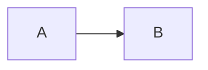

# yoosuf.github.io

The personal site and blog of **Yoosuf Mohamed** — Systems Architect specializing in AI automation, LLM, RAG, Go, Elixir, FastAPI, and AI-first products.

Live at [https://yoosuf.me](https://yoosuf.me), deployed via GitHub Pages.

## Stack

- **Static site generator:** [Astro](https://astro.build/) 7 (static output)
- **Styling:** StyleX 0.19 with semantic tokens and static Vite extraction (`src/styles/`)
- **Interactivity:** React 19 islands + TypeScript (`@astrojs/react`) — header nav/dialog, services accordion
- **Fonts:** system UI + monospace stack only (zero webfont requests)
- **View transitions:** `ClientRouter` from `astro:transitions` with `prefetch`
- **Hosting:** GitHub Pages (CNAME → `yoosuf.me`)

## Local development

Requirements: Node **22** (system node is v20).

```bash
nvm use 22
npm install
npm run dev                # http://localhost:4000
npm run build              # build into dist/ (also a good smoke test)
npx tsc --noEmit           # typecheck TS/TSX
```

The generated site goes into `dist/` (gitignored).

## Mermaid diagrams

Use `MermaidDiagram.astro` when a page needs an explicit title, caption, variant, or accessible label:

```astro
---
import MermaidDiagram from '../components/diagrams/MermaidDiagram.astro'

const architecture = `flowchart LR
  User --> Web
  Web --> API
  API --> Database`
---

<MermaidDiagram
  code={architecture}
  title="Application architecture"
  caption="High-level request flow."
  ariaLabel="A user request flows from the web application through the API to the database."
  variant="pencil"
/>
```

The default renderer uses Mermaid's deterministic `handDrawn` look with seed `42`. Use `variant="marker"` for a cleaner whiteboard surface; both variants use Mermaid SVG and the site's light/dark color scheme. Existing ` ```mermaid ` fences in MDX posts use the same renderer automatically. Mermaid frontmatter remains authoritative, so a diagram can opt into another native look:

````markdown

````

See `/examples/diagrams/` for flowchart, architecture, sequence, state-machine, and override examples.

For readability in the document column, horizontal `flowchart LR/RL` and `graph LR/RL` declarations are rendered top-to-bottom by the shared browser renderer. The original Mermaid source remains unchanged in the post or page.

## Project structure

| Path                            | Purpose                                                              |
| ------------------------------- | ------------------------------------------------------------------- |
| `src/content/blog/*.md`         | Blog posts. Filename: `YYYY-MM-DD-slug.md`                           |
| `src/content.config.ts`         | Content collection schemas (front matter contract)                  |
| `src/layouts/`                  | `BaseLayout.astro` (shell), `PostLayout.astro`, page layouts        |
| `src/components/`               | Astro components + React islands (`header/`, `services/`, `ReactIcon.tsx`) |
| `src/hooks/useMenuDialog.ts`    | Modal dialog a11y hook (focus trap, Escape, scroll lock)            |
| `src/pages/`                    | Route pages; `blog/[...slug].astro` renders posts                   |
| `src/data/services.ts`          | Service data shared by Astro + React                                |
| `src/config.ts`                 | `SITE`, `NAV`, socials — single source of truth                     |
| `src/styles/global.css`         | Design tokens, `.site-container`, motion, component classes         |
| `public/`                       | `llms.txt`, `CNAME`, images, `robots.txt`, `site.webmanifest`       |

## Writing a post

1. Create `src/content/blog/YYYY-MM-DD-your-slug.md`.
2. Use the front matter template below (schema in `src/content.config.ts`).
3. Write in a **personal, first-person voice** (see the `astro-blog` skill / AGENTS.md guidance).
4. Run `npx tsc --noEmit` + `npm run build` to confirm it builds clean.
5. Add notable posts to `public/llms.txt`.

### Front matter template

```yaml
---
title: "Your Post Title"
subTitle: "Optional one-line summary shown under the title"
author: Yoosuf Mohamed
date: 2026-08-15 08:00:00
permalink: /blog/your-post-slug
published: true
description: "SEO/meta description of the post."
categories: ["AI & Tech"]
tags: ["AI", "Productivity", "Management"]
---
```

Conventions:

- `permalink` is `/blog/<slug>` (no trailing slash, no date); filename date matches `date`.
- `categories` from the existing set: `AI & Tech`, `Engineering`, `Personal`, `Photography`, `Lifestyle`, etc.
- `tags` are comma-free, Title Case, existing tags reused where possible.
- `date` is parsed as UTC but Astro does **not** skip future-dated posts — no timezone gotcha.
- Keep the post's first paragraph self-contained — it doubles as the intro/excerpt.

## Deployment

Pushing the `feature/astro-tailwind` working branch's `dist/` to GitHub Pages serves the site
(static files, no build on the Pages side). CNAME is committed so the custom domain is preserved.

## Notes

- `build.inlineStylesheets: 'always'` inlines all CSS into HTML — there is no external
  stylesheet request; don't reintroduce one.
- Islands hydrate per navigation (never put `transition:persist` on a React island).
- Don't commit `dist/` or `.astro/` (gitignored).
- Update `llms.txt` when adding notable posts so LLM crawlers can find them.
