Event-driven architecture is easy to start.

Install Kafka. Add RabbitMQ. Configure SNS and SQS. Publish an event. Subscribe to it somewhere else.

Suddenly the architecture diagram looks sophisticated.

But using an event broker does not automatically mean you understand event-driven architecture.

The real complexity starts after the first event has been published. What happens when the same event arrives twice? What happens when events arrive in the wrong order? What happens when the database succeeds but publishing fails? What happens when one service fails halfway through a workflow involving five other services?

And perhaps the most important question: **should this interaction have been event-driven in the first place?**

Those are the questions that separate someone who knows an event-driven framework from someone who understands distributed systems. Here are ten questions I would use to evaluate whether an event-driven architecture is actually production-ready.

---

## 1. What happens if the same event is delivered twice?

One of the first assumptions that disappears in distributed systems is: "this message will only be processed once."

In many production systems, you should assume the opposite. An event may be delivered more than once.

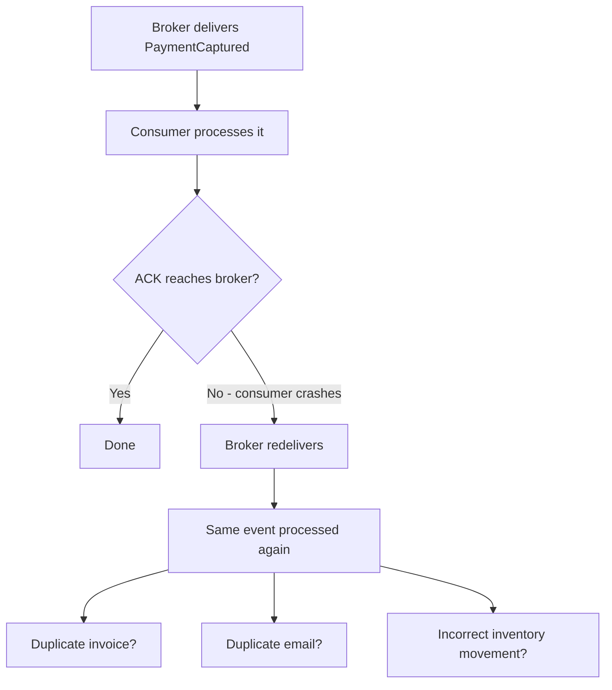

If the consumer blindly processes the event twice, you can end up with:

- duplicate payments
- duplicate invoices
- duplicate emails
- duplicated ledger entries
- incorrect inventory movements

That is why **idempotency** is a fundamental part of event-driven architecture. A consumer may store processed event IDs and check before processing:

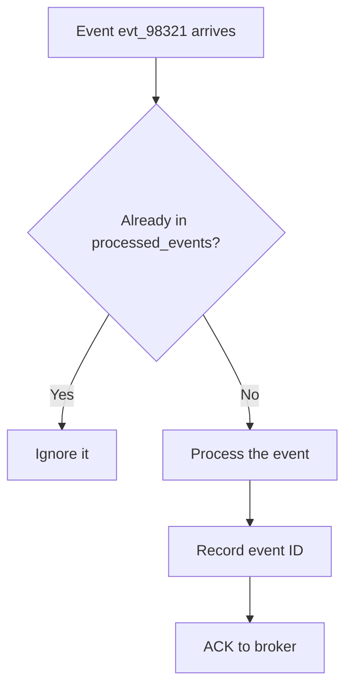

But idempotency can also exist at the business-operation level. "Set payment status for ORD-10042 to CAPTURED" is easier to make idempotent than "increase captured amount by $125."

The architectural question is not "can duplicates happen?" — they can. The real question is: **can the system remain correct when they do?**

---

## 2. What happens when events arrive out of order?

Consider an order lifecycle:

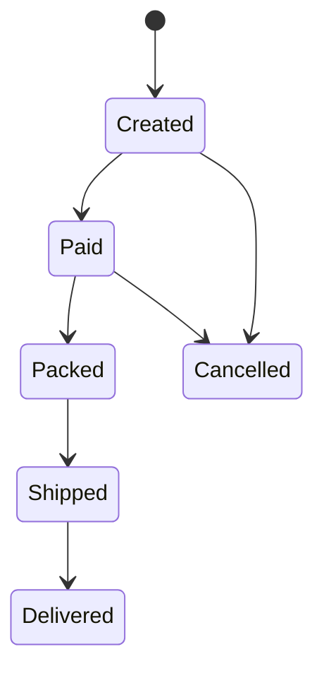

That sequence makes sense. But distributed systems do not always deliver events exactly how humans expect them to arrive. A consumer might observe the events in a different order entirely:

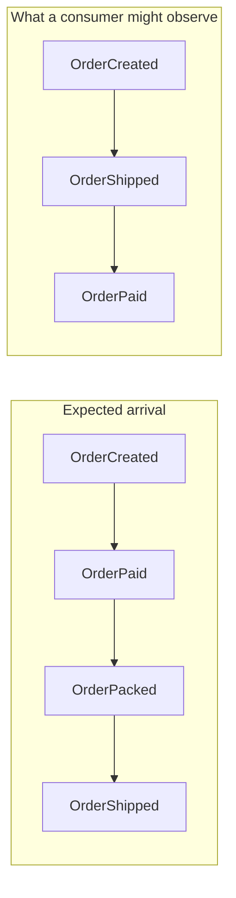

Or worse — a cancelled order shipped:

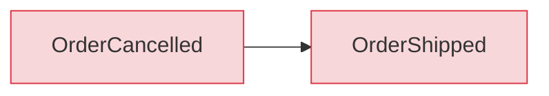

Developers sometimes respond with: "Kafka guarantees ordering." That statement is incomplete. The correct question is: **ordering within what boundary?**

Kafka can preserve ordering within a partition. That does not mean your entire distributed system has universal global ordering. You therefore need to think about:

- partition keys
- aggregate boundaries
- sequence numbers
- entity versions
- stale event detection
- state-machine validation

An event might include an aggregate version:

```json
{
  "eventId": "evt-338",
  "aggregateId": "order-1024",
  "aggregateVersion": 17,
  "type": "OrderShipped"
}
```

If the consumer has already processed version 18, version 17 may be stale and safely ignored. Another option is to model valid state transitions. If an event attempts to transition `CANCELLED → SHIPPED`, the domain model should reject it.

**Message ordering is an infrastructure capability. Business ordering is a domain problem.**

---

## 3. What happens if the database succeeds but publishing the event fails?

This is one of the most important failure scenarios in event-driven systems. Without any safeguards, this is what happens:

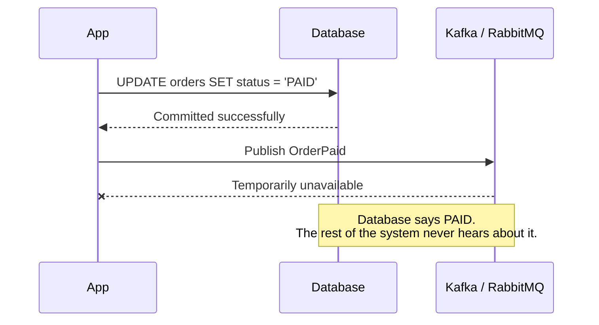

The database says one thing; the rest of the system believes another. The consequences ripple outward:

- the inventory service never reserves stock
- the fulfillment workflow never starts
- the customer never receives confirmation

A common solution is the **Transactional Outbox Pattern**. Instead of updating the database and then publishing as separate steps, you perform both persistence operations inside the same database transaction:

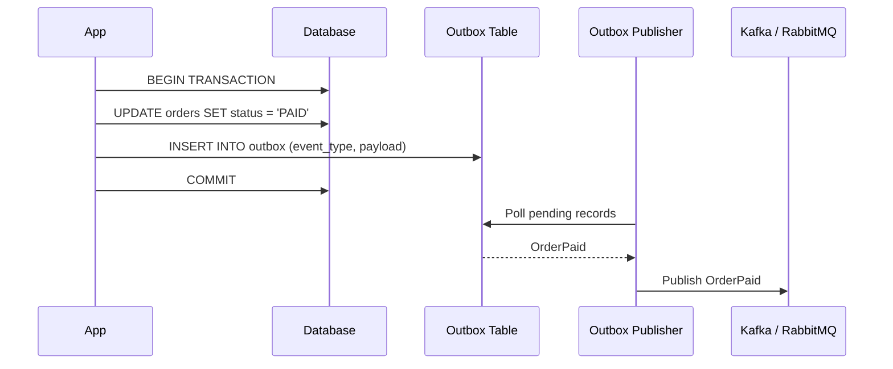

The important principle is: **the business state change and the intent to publish must share the same consistency boundary.** Without this, it is very easy to create invisible distributed data loss.

---

## 4. Is this really an event, or is a command disguised as one?

Naming messages correctly matters more than it appears. Consider `SendInvoiceEmail` and `InvoiceGenerated`. They are not the same thing.

`SendInvoiceEmail` expresses intent — someone is asking another component to perform an action. That is usually a **command**. `InvoiceGenerated` represents something that has already happened. That is an **event**.

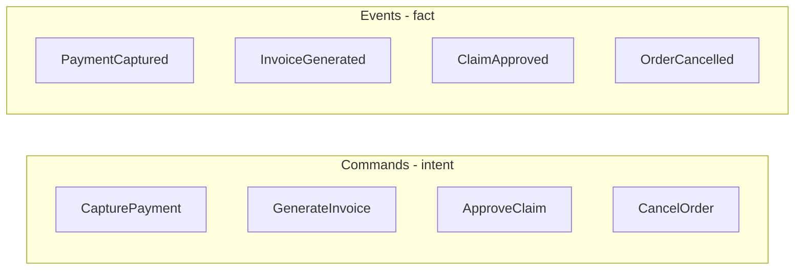

This distinction matters because commands and events create different coupling models.

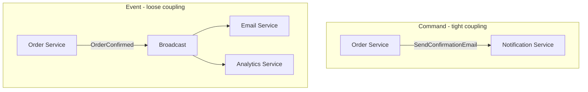

With a command, the Order Service knows exactly what the Notification Service should do. With an event, the producer simply announces what happened and consumers independently decide whether they care.

A useful test: if nobody consumes this message, has the business fact still happened? If yes, it is probably an event. If the system expects someone to perform an action because of the message, you may actually be dealing with a command.

Calling everything an "event" does not make the system event-driven.

---

## 5. Who owns the event contract?

Events become APIs. And just like APIs, they evolve.

Suppose your original event looks like `{ "customerId": 1024, "name": "Yoosuf Mohamed" }`. Six months later, someone wants to split it into `firstName` and `lastName`. That looks like a harmless refactor. It may not be.

There may already be a CRM service, marketing service, billing service, analytics service, notification service, and a data warehouse all consuming `name`. Changing an event schema can break systems you do not even deploy together:

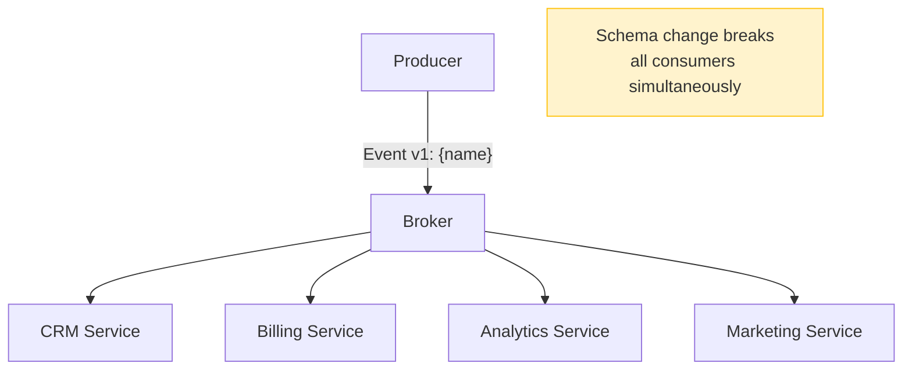

Architects need to think about:

- backward compatibility
- forward compatibility
- schema evolution
- additive changes
- optional fields
- semantic versioning
- event ownership
- deprecation windows
- schema registries
- consumer contract testing

Instead of deleting fields immediately, you might temporarily evolve the event — include both `name` and `firstName`/`lastName` in version 2. Older consumers continue functioning. Newer consumers migrate. Eventually, the old field can be retired through an explicit compatibility process.

The real question is not "can the JSON still deserialize?" It is: **can dozens of independently deployed consumers survive years of contract evolution?**

---

## 6. What happens when a consumer keeps failing?

The event is retried. It fails again. Then again. What happens next?

Retrying forever is not a strategy. Retrying immediately can make things worse. If the downstream system is overloaded, sending more requests every few milliseconds can turn a small outage into a much larger incident.

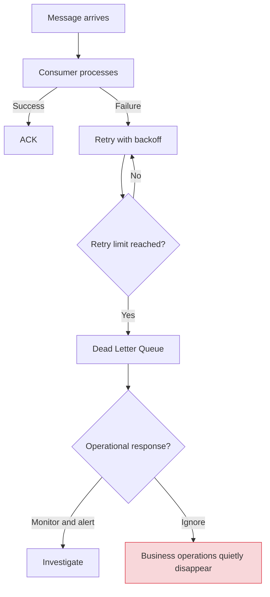

But adding a DLQ does not solve the operational problem. You must still answer:

- Who monitors it?
- When should alerts fire?
- Who investigates failures?
- How are messages corrected?
- How are messages replayed?
- What happens after replay?
- Can reprocessing cause duplicate side effects?

A dead-letter queue without operational ownership is simply a graveyard where business operations quietly disappear. Production EDA requires a failure strategy, not merely a failure destination.

---

## 7. How do you handle partial failure across multiple services?

Consider an e-commerce checkout. Now imagine: order created, payment captured, inventory reserve failed. What now?

You cannot usually wrap Order DB, Payment DB, Inventory DB, and Shipping DB inside one traditional ACID transaction. Instead, distributed systems often rely on **Sagas** — a sequence of compensating actions.

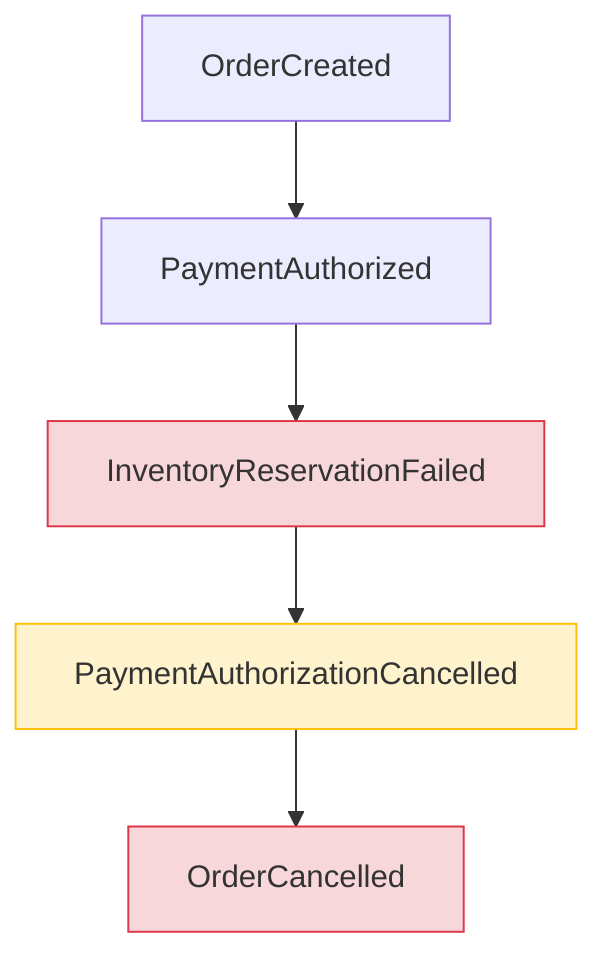

The next architectural decision is whether the workflow uses choreography or orchestration.

### Choreography

Each service reacts to events and emits another event. No central coordinator.

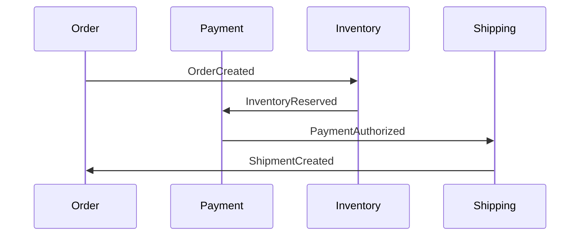

This can be elegant for simple flows. But as the process grows, it can become difficult to understand.

### Orchestration

A workflow component coordinates the process.

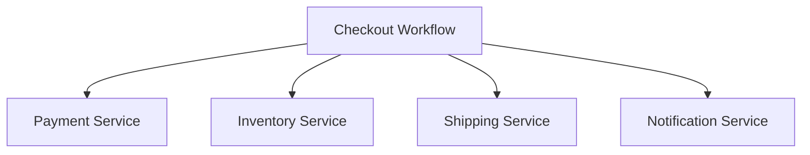

The orchestrator explicitly knows the workflow. This creates more centralized logic, but can significantly improve observability and control for complex business processes.

Neither approach is universally correct. Architects choose between them based on:

- workflow complexity
- team ownership
- compensation requirements
- visibility
- coupling
- auditability
- operational requirements

The important thing is that distributed workflows need explicit failure semantics.

---

## 8. What is the source of truth?

Once events enter an architecture, this question becomes critical. Where does truth live? Is it:

- PostgreSQL?
- Kafka?
- an Event Store?
- a materialized projection?

These are very different architectures.

In many event-driven applications, the database is the source of truth and events are notifications about changes. In Event Sourcing, events are the source of truth and current state is derived by replaying historical events.

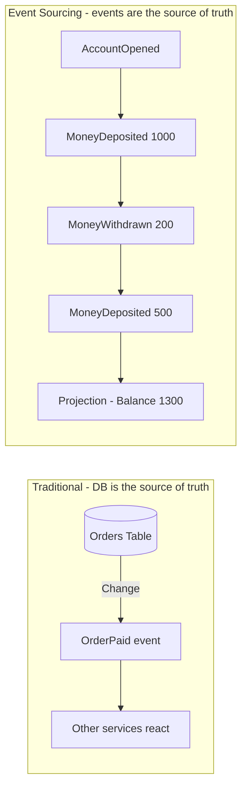

This distinction is important: **event-driven architecture does not automatically mean Event Sourcing.** You can use Kafka without Event Sourcing. You can use RabbitMQ without CQRS. You can use events while PostgreSQL remains the authoritative source.

Event Sourcing can be extremely powerful for domains requiring complete audit history, temporal reconstruction, complex domain transitions, and historical state replay. But it also introduces significant complexity. A strong architect knows not only how to implement Event Sourcing — they know when not to use it.

---

## 9. How do you debug a business transaction across ten services?

In a synchronous application, debugging is relatively easy — one request, one trace, one response:

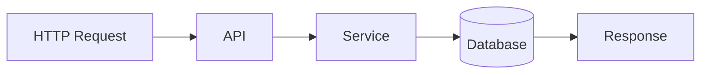

An event-driven workflow may involve events across multiple services, several databases, different queues, multiple regions, and spans of minutes or hours. Now imagine customer support asks: "why was order 83492 never shipped?" Without proper observability, answering that question can become painful.

Events should carry enough metadata to reconstruct causality:

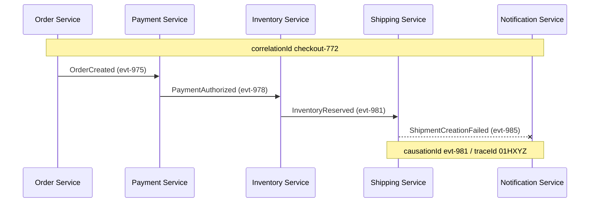

Now you can reconstruct the whole chain — correlation IDs, causation IDs, trace IDs, event IDs. A mature platform should think about:

- distributed tracing
- structured logs
- correlation IDs
- event IDs and causation IDs
- metrics and consumer lag
- failed-message dashboards
- workflow state inspection

Observability is not something you bolt onto an event-driven architecture later. It is part of the architecture itself.

---

## 10. Should this interaction be event-driven at all?

This may be the most important question on the list. Engineers sometimes discover Kafka and suddenly every interaction becomes an event. That is usually a warning sign.

Imagine you need customer details. This may be completely reasonable:

```http
GET /customers/123
```

You probably do not need this — a request, a broker round-trip, a response, another broker round-trip:

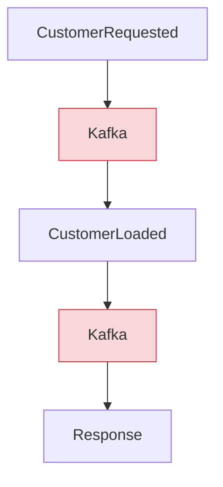

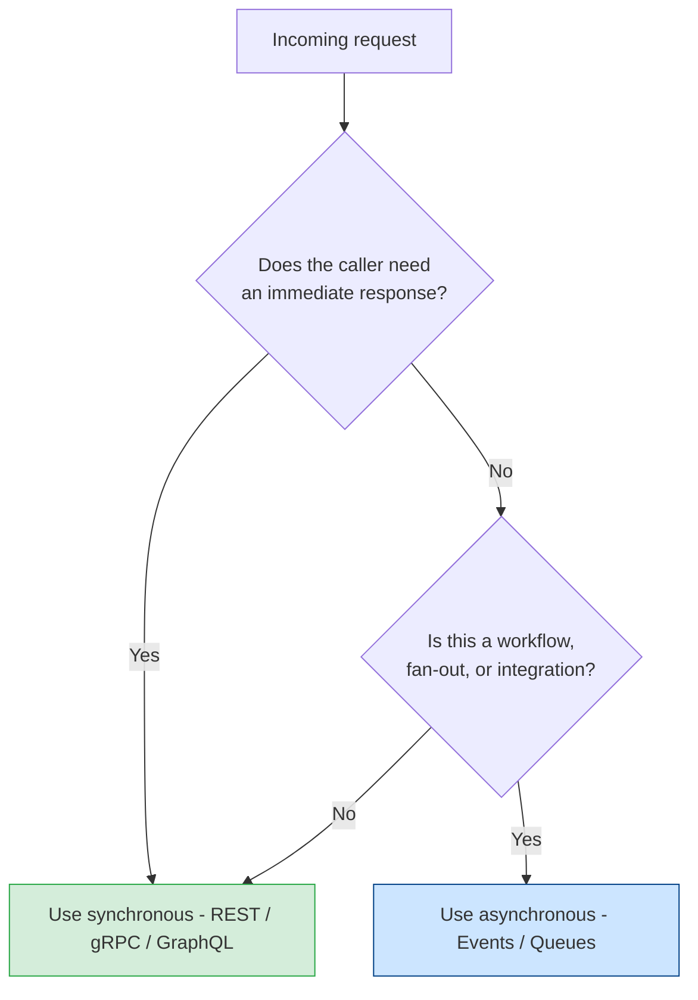

Event-driven communication makes sense when you need:

- asynchronous processing
- temporal decoupling
- fan-out to independent consumers
- buffering and scalable processing
- workflow propagation
- integration events
- eventual consistency

Synchronous communication is often better when:

- the caller needs an immediate response
- the interaction is request-response
- strong consistency is required
- failure must be returned immediately
- there is no meaningful reason to decouple the participants

Many mature architectures intentionally use both. The architectural skill is not knowing how to introduce Kafka — it is knowing **where Kafka does not belong**.

---

## The architect-level test

If I were interviewing for a system using event-driven architecture, I would ask questions like these:

1. How do you guarantee idempotent consumption?
2. How do you handle duplicate and out-of-order events?
3. How do you guarantee consistency between database changes and event publication?
4. Is this message an event, command, or query?
5. How will event contracts evolve without breaking existing consumers?
6. What is the retry, backoff, poison-message, and DLQ strategy?
7. How does the system recover from partial failure across multiple services?
8. What is the authoritative source of truth?
9. How do you trace and debug an asynchronous workflow across services?
10. Why should this interaction be event-driven in the first place?

If most of the answers involve tool names — Kafka, RabbitMQ, MassTransit, Spring Boot, NestJS, MediatR, NServiceBus, AWS EventBridge — then the discussion is still mostly about tools. Those tools are useful. But architecture happens one level above them.

The stronger answers start talking about:

- idempotency and delivery semantics
- consistency boundaries
- aggregate ordering
- schema evolution
- failure domains
- temporal coupling
- compensation
- observability
- replay and recovery

That is where event-driven architecture becomes a distributed-systems problem rather than a framework configuration exercise.

---

## And there is an 11th question

There is one question I would add for systems handling money, emails, notifications, inventory, claims, or other external side effects: **how would you safely replay six months of events without replaying six months of real-world side effects?**

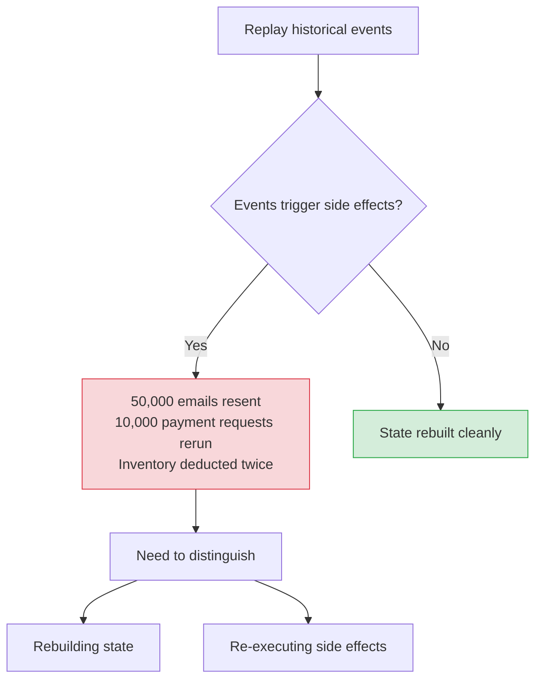

That distinction affects:

- event replay
- projections
- idempotency
- integration boundaries
- consumer design
- migration strategies
- disaster recovery

If a team cannot explain how replay works safely, the event-driven architecture probably is not as mature as the architecture diagram makes it look.

---

## Final thought

Event-driven architecture is not difficult because publishing an event is difficult. Publishing is the easy part.

The difficult part is accepting that once services communicate asynchronously, many assumptions from a traditional application disappear. Messages can be duplicated. Messages can arrive late. Consumers can fail. Services can disagree temporarily. Schemas evolve independently. Workflows can partially complete. Networks disappear. And eventually someone will need to understand exactly what happened to one customer transaction three months ago.

That is why understanding event-driven architecture requires more than understanding Kafka, RabbitMQ, or a framework abstraction.

**Frameworks teach you how to publish events. Architecture teaches you how to remain correct when everything around those events starts failing.**