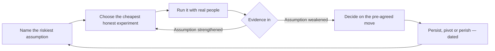

Every week someone shows me the same message: "I built my MVP in a weekend with AI."

And sometimes it genuinely is impressive. A support tool that reads emails and drafts replies. A niche note-taking app with a clean UI. Pricing page, auth, a little dashboard. All shipped in forty-eight hours.

Then I ask the question the shipper usually hasn't asked yet: what did you learn?

That's where the excitement dies. Because most of the time the answer is some version of "we learned we could build it." Which isn't a learning. It's a receipt.

AI didn't change what an MVP is for. It changed how cheaply you can do the part that was never the hard part. So the way I'd put it now is this: read the whole history of famous MVPs and the thing you'll notice is that almost none of them were about the engineering. They were about the question.

## Minimum viable never meant small

Eric Ries's definition, from *The Lean Startup*, still holds and it's quietly brutal: the minimum viable product is that version of a new product that allows a team to collect the maximum amount of validated learning about customers with the least effort.

Notice what that makes explicit. The MVP isn't a feature-lite preview of your finished product. It's an experiment engineered to produce a decision. The unit of success isn't "shipped." It's "learned something we couldn't have known without a real customer."

The "minimum" was never an aesthetic preference for smallness. It was a strategy for protecting a scarce resource: your budget, your time, your attention. If you've got two engineers and three months of runway, the *size* of the thing is the whole game. You physically cannot build everything, so the constraint forces you to choose what actually matters.

That's the scarcity AI removed. And it's exactly why so many people get the AI-era MVP wrong.

## Building used to be the bottleneck

Cast your mind back to the before times. An MVP meant months. You'd skin a design, wire up auth, stand up a database, handle payments, write copy, debug the deployment, and only then — weeks or a small fortune later — could a stranger touch your idea.

There was a real cost to that. But it did a dirty job for you: it policed your scope. You couldn't build the whole dream, so you had to pick the one assumption worth risking the entire budget on. The budget enforced prioritization whether you wanted it to or not.

The old MVP was the smallest product you could afford, stretched thin over the thing that mattered most.

The AI-era MVP doesn't have that governor.

## The bottleneck moved

Now the build is nearly free. Two people, one weekend. Landing page, auth, database, UI, tests, docs. A scaffold that would have taken a contractor a month costs you an afternoon of prompting.

So the entire MVP discipline flips. The question stops being "what's the minimum I can build inside my budget" and becomes "what's the minimum I can build that would genuinely test my riskiest assumption?"

And here's the trap hiding in that flip. Because building is cheap, the temptation is to build a *full* product. But a full product isn't a better MVP — it's a worse experiment. It loads a dozen untested assumptions into one lump of software. When it launches to crickets, you can't tell which assumption was wrong: the problem, the customer, the pricing, the channel, the timing? You spent a weekend (or a month) building a machine to test nothing but whether people would show up to an empty room.

The point of minimum isn't to be small. It's to keep the experiment legible. If one thing fails, you want to know exactly which thing it was.

## What the industry actually proves

Before we get to the AI-era traps, it's worth laying down the evidence. These are the MVPs that built the companies you've heard of. Read the list and notice the pattern: the product almost never came first.

| Company | The MVP | What it actually tested | What happened |
| --- | --- | --- | --- |
| Dropbox | A three-minute video of software that didn't exist yet | Whether the idea itself created demand | Beta waitlist jumped from roughly 5,000 to 75,000 overnight |
| Zappos | Buying shoes from local stores, photographing them, shipping by hand | Whether people would buy shoes online untried | A tiny proof that eventually grew into a billion-dollar retailer |
| Airbnb | Three air mattresses rented out during a design conference | Whether strangers would host and rent — at all | First real bookings, then an entire category |
| Groupon | A WordPress site with deals hand-written and emailed as PDFs | Whether merchants would pre-buy discounted volume | Chicago experiment that defined daily-deals |
| Buffer | A landing page with pricing tiers whose "sign up" went nowhere | Whether anyone wanted the product and which plan | Early signups and tier choices collected before a line of code |
| Midjourney | A Discord server where you typed prompts to generate art | Whether people would subscribe to AI art in a chat app | A million-plus-member community before any native app shipped |
| ChatGPT | A thin chat wrapper over existing model technology, offered as a free research preview | Whether consumers wanted conversational AI at all | 100 million users in two months, the fastest consumer adoption then on record |

Some of these "MVPs" contained almost no engineering at all — Groupon is a blog with a PDF, Midjourney is a chat channel, Dropbox is a video. The building was never the point. The question was, and the answers were unambiguous.

The one caveat: ChatGPT and Midjourney are AI-era examples where the teams already owned unusual technology or community. Don't read them as "ship a wrapper and win." Read them as "make the front door the cheapest possible thing that proves whether people want what's behind it."

## The three traps of the AI-era MVP

I've watched enough of these now to name the ways they go wrong. There are three, and most failed AI MVPs hit at least one.

### Trap 1: polishing, not shipping

Melissa Perri calls it the Build Trap — teams that ship feature after feature and call it product work, when really they're just moving production. AI makes the Build Trap pathological, because the marginal cost of "one more thing" is a prompt.

So the founder keeps adding. Better onboarding. A dashboard refinement. Export as CSV. A dark mode because dark mode is easy now. Nothing about the product gets meaningfully better for the customer, but the "MVP" keeps not launching, because it's never quite *viable* enough — a status anxiety that's expensive precisely because shipping is now cheap but deciding is still hard.

The poster child for the Build Trap, in the pre-AI era, is Juicero. The company raised around $120 million and shipped a $400 countertop juicer — a polished, internet-connected machine with proprietary QR-coded juice packs. It was to be the Apple of fresh juice. Then a Bloomberg reporter squeezed a pack by hand and got essentially the same result the $400 machine produced. The problem — do people actually want a gadget between them and their juice? — was never the thing being tested. The build had outrun the question, and the company shut down within a year of that report.

The classic MVP death was a product too small to be useful. The AI-era death is a product too finished to fail inconspicuously.

### Trap 2: validation by vibes

Here's the one that stings. Ask an LLM whether your idea is good and it'll hand you a glowing report. It will list plausible customer pain points, compute a market size that sounds rigorous, name competitors, sketch an upside. It's confident, fluent, and completely useless as evidence.

An LLM will generate the customer complaints you hoped for. That's not discovery, that's literary fiction. Asking ChatGPT whether your idea is good is like asking a mirror — you'll always get a flattering answer. Real customer discovery still has to happen in the world, with humans who have the problem and would or wouldn't pay to solve it. That part has not been automated. Anyone who tells you otherwise is selling prompts.

The industry history agrees, almost cruelly. In the CB Insights autopsy of startups that failed, the most-cited *symptom* was running out of capital, but the leading *root cause* has consistently been poor product-market fit — a market that never truly existed, however much the pitch deck said otherwise. You can't confabulate your way to product-market fit. The founders who claim they "validated with AI" almost always validated with a mirror.

### Trap 3: mistaking attention for demand

You launch the landing page, collect 500 emails, and declare validation. Five hundred emails is promise, not behavior — signups cost nothing. The gap between "interesting" and "I'll reorganize my workflow and give you money" is where real products are won and pretend products are exposed.

There's a whole graveyard of examples at this exact point. Color raised $41 million before it had shipped, on the strength of its founding story and the size of the moment — investors were sold on the pitch, not the product. The attention was enormous. The retained users, essentially, were not, and the app fizzled within a couple of years. A slightly older one: Google Wave attracted outsized curiosity at launch — a million invites chased it — and the whole thing was shut down because fascination never converted into durable use. People who merely like things usually don't give you money.

The honest version of the smoke test converts attention into an action with a cost: a paid pre-order, a scheduled onboarding call, a deposit. Emails are a promise. Booked conversations and charged cards are evidence.

## The playbook this era rewards

The good news: the actual MVP process is the same as it ever was. The order is identical. Only the speeds changed.

Run the loop. Cheap loops are why the AI era is a gift for anyone who actually tests — you can fit five of these into what used to be one.

1. **Name the riskiest assumption.** The one thing that, if false, kills everything else. Usually it's not "can we build this" — it's "do humans with this problem exist and would they pay." Dropbox's riskiest assumption was never "can we build file sync" — the founder had built worse — it was "will people want seamless sync waiting on nothing." That's why the video was the perfect test: it isolated demand from build.
2. **Choose the cheapest experiment that actually tests it.** Not the cheapest thing that looks related. The cheapest thing that produces a real, falsifiable answer. Groupon's WordPress page tested merchant willingness to buy discounted volume better than any prototype could have. Midjourney's Discord server tested willingness to pay for AI art in the least buildy way imaginable.
3. **Let AI compress everything except the experiment itself.** Copy, code, diagrams, infrastructure, onboarding flows — all cheaper than ever. But the experiment — a real customer doing a real thing with their real time or money — never gets outsourced to a prompt.
4. **Decide on evidence, in advance.** Signal, threshold, pre-agreed move. I wrote about perish/pivot/persevere recently and the rules are the same here; the cheap build just lets you reach your decision point faster, for less money.

The winning team in this era isn't the one that builds the most impressive single product. It's the one that runs five cheap, honest loops in the month it used to take rivals to run one expensive, vague one.

## The experiment is the one thing AI can't fake

The cheapest test of "is this a real market" is the smoke test: one landing page, a clear offer, a waitlist or a pre-order button, then traffic. With AI you can draft the copy, build the page, and set up the funnel in an afternoon. What AI cannot do is earn the traffic or collect the receipts. That's still on you, and it's still the whole job.

Then there's the concierge, or Wizard of Oz, MVP — and this is the one I suspect founders sleep on. Ship the *front door* of the product: a form, an email address, the promise of the service. Behind it, do the work by hand, with you and an LLM as the entire backend.

This looks like cheating and it isn't. The assumption you're testing is not "can the technology do this." It's "is there a human being whose problem is painful enough that they'll trust this front door to fix it." The code is trivially replaceable later; the demand isn't. The classic name in this category is Zappos: founder Nick Swinmurn photographed shoes at local retailers, listed them, and shipped purchases by hand out of his apartment — no warehouse, no inventory system, nothing. The machinery was fake, the transaction was real. Global shoe retail online convinced itself from that preposterous little loop.

The AI-era version is even better, because the backend is cheaper to fake. I've watched founders run "fully automated AI products" that were really them at a desk, pasting LLM output into an inbox — and that's not a confession, that's a technique. You're testing whether the promise of the product is worth something to someone. If you can serve a real user by hand with LLM assistance in ten minutes, you don't build software yet. You run the transaction. You learned more in one afternoon than a month of scaffolding would tell you.

## Scale makes a bad bet worse

There's a specific failure mode worth naming for the AI era, because everyone's convinced speed means you can afford it: scaling a bad bet *faster*.

Quibi is the expensive monument. It raised somewhere in the region of $1.75 billion, built a polished mobile streaming platform with A-list talent, launched hard with a fanfare, and shut down about six months later. The post-mortems argued about phones killed it, or COVID killed it, but the structural reading is simpler: the team validated the funding story, not the product. There was no cheap loop. There was no moment where eleven users a week told them "this isn't for me" at a cost of an afternoon. They spent venture capital the way earlier eras' losers spent years, and the decision surface only appeared once the money was already gone.

This matters more now than it did before, for a counterintuitive reason. The *cost* of building fell, so the temptation to skip the cheap experiment and go straight to "real product" costs you less money than it used to — but you're still giving up the learning loop, which is now the only thing that was ever scarce. Cheap builds plus skipped experiments is how you spend $40,000 and a quarter thinking you validated, when a $200 landing page and forty phone calls would have told you the truth in two weeks.

## The parts AI didn't touch

The cost of making the solution collapsed. The cost of finding the problem didn't. That asymmetry is the entire economics of the current moment, and I think it's worth stating plainly.

Because everyone can ship now, shipping is worthless as a differentiator. Not worthless — table stakes. The moats that remain are the ones a prompt can't reproduce:

- **Distribution.** Being found. How you reach buyers when a thousand other teams can now build your product by Saturday. Midjourney's early moat wasn't the model — so many teams could generate images — it was the community that grew inside Discord first.
- **Trust.** The people who'll take a meeting with you, believe your promises, forgive your bugs. This is why the Airbnb story is still instructive: the product was trivially copyable, the trust required to host strangers in your home was not.
- **A genuine understanding of the problem.** The founder who's lived in the customer's world wins on comprehension, not on code. Dropbox won with a video because its founder had rebuilt file sync enough times to know precisely which pain to dramatize.

None of that was ever the hard part of writing software. It was always the hard part of building a company. AI just removed the noise that used to hide it.

## Decide on a schedule, not on a feeling

The one casualty of cheap builds is discipline. When every experiment costs a weekend, it's tempting to run them forever, drifting from tweak to tweak, mistaking motion for learning.

So attach a date to the experiment before you run it. "By October 15, if fewer than X people take the paid action, we change the core assumption." Cheap loops are only an advantage when you let them terminate in a decision. An experiment without a termination date isn't a learning loop — it's a hobby with a domain name.

And resist the worst advice the era spawns: that you should keep AI-building while you "wait to see." You're never waiting to see. You're deferring the only two things that ever mattered — finding the problem and finding the people. Get them early, get them cheap, and let AI spend its time on everything else.

## The AI-era MVP is more of an MVP, not less

When building is nearly free, the minimum viable product becomes nearly all product and almost none of the "building." The discipline moves fully to the harder end: naming a falsifiable assumption, choosing an experiment that honestly tests it, and sitting face to face with someone who either pays or doesn't.

Look back at that table. Dropbox's MVP was a video. Groupon's was a PDF. Zappos's was a man with a camera and a post office run. Midjourney's was a chat channel. The most valuable parts of those companies were identified long before the impressive engineering existed — because the founders were testing demand with whatever was cheapest, not building toward a launch.

Ship the smallest thing that teaches you something a prompt can't invent — whether a real person, with a real problem, will hand over their money, their email, or an hour of their time.

Every week someone builds an "MVP" in a weekend and calls it validated. The marker of the ones that count isn't that they shipped. It's that, by the end of the weekend, they knew something they didn't know on Friday that a stranger *proved* to them. Build fast by all means — just make sure you're building the evidence, not just the app.
