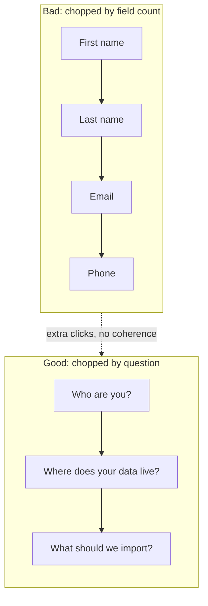
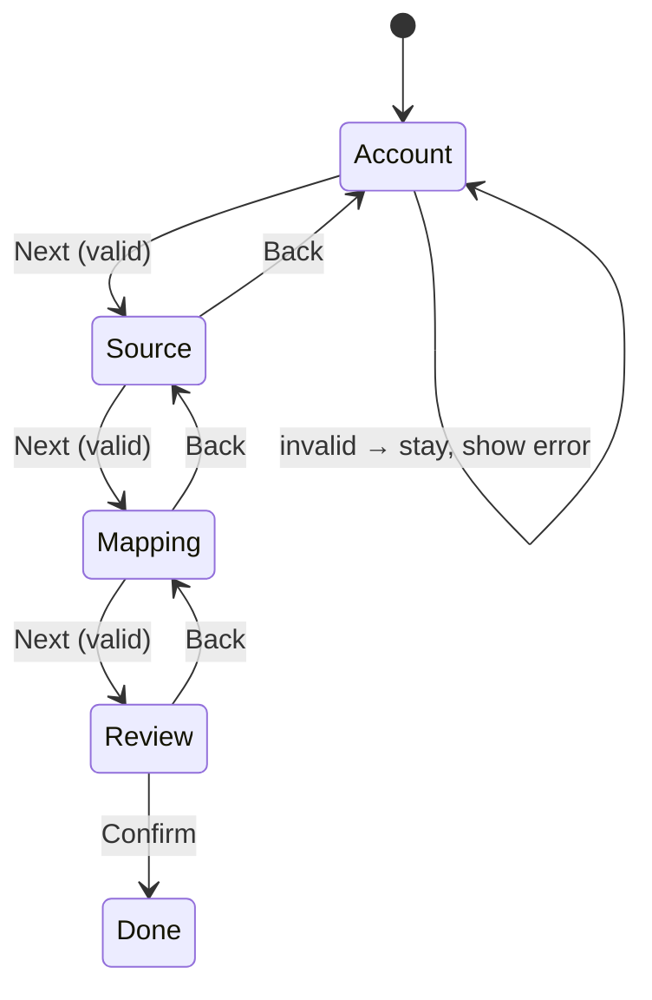
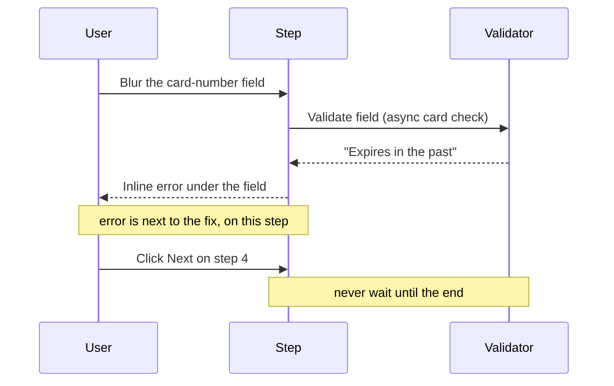
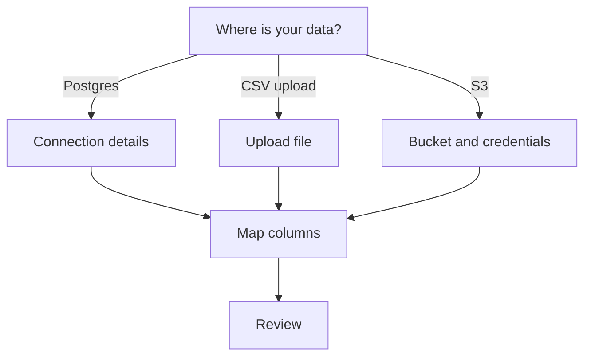
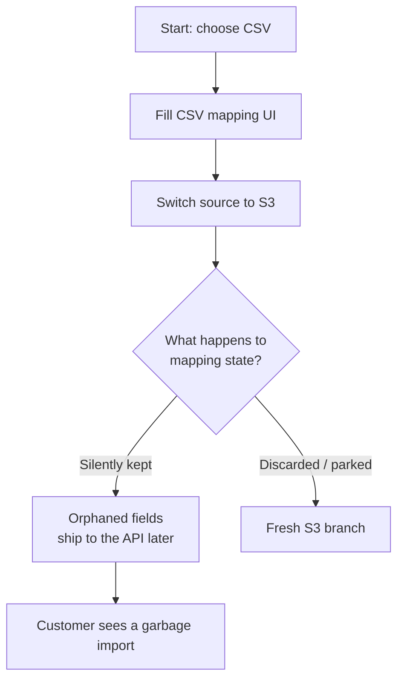
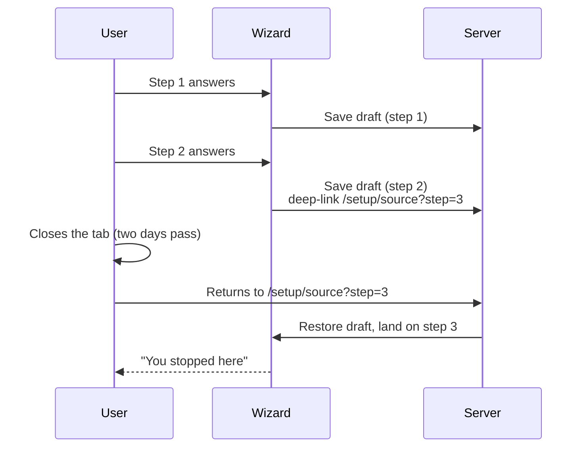
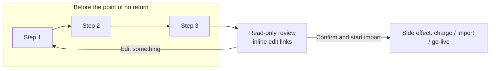
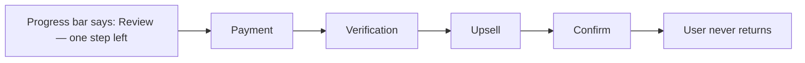
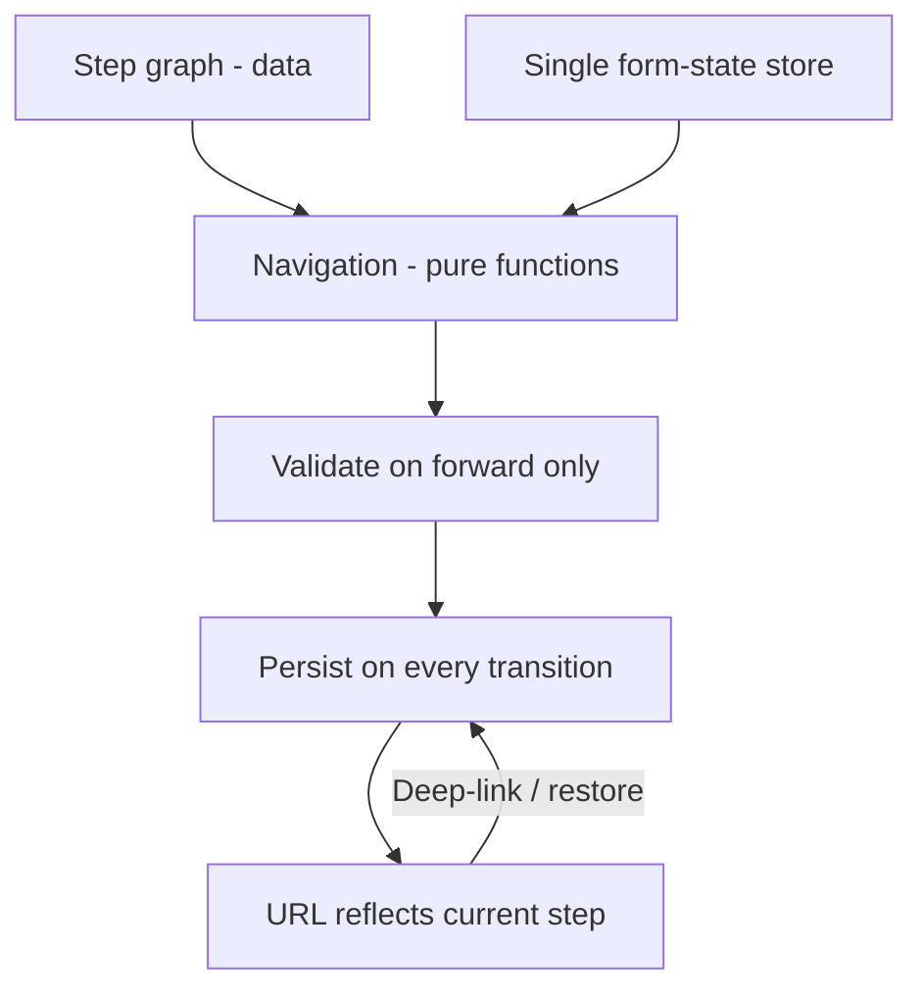

Every product eventually grows a wizard. Onboarding, checkout, billing setup, importing data, connecting an integration — somewhere along the line someone decides the flow has "too many fields for one screen" and splits it into steps.

That decision is usually right. The execution almost never is. Most wizards I use are a worse version of the form they replaced: progress bars that lie, back buttons that eat your input, validation that only fires when you hit final submit, and nine steps where three would do.

The good ones are recognizable because they're the ones you finish without noticing. Stripe checks out without you thinking about it. Duolingo gets you into your first lesson in under a minute. TurboTax makes you feel like you're answering questions a person would ask. These companies didn't stumble into that — the patterns are specific, and they're reproducible.

I've built enough of these to have strong opinions. Here's how I think about implementing a wizard properly, with the real products as proof.

## First, earn the right to be a wizard

A wizard is not a free UX upgrade. It's a trade. You're buying cognitive ease per screen at the cost of perceived effort overall — "four short steps" often feels like more work than one scrollable page, because every Next click is a commitment.

The research on this is old but it holds up. Luke Wroblewski's *Web Form Design: Filling in the Blanks* made the case two decades ago that people slow down, reread, and quit as forms grow — and that breaking them into chunks helps *as long as* the chunks are coherent and the progress is honest. The failure mode is chopping by arbitrary field count — "step 3 of 7" where each step is two inputs — which just multiplies clicks.

You can see the numbers in commerce. Baymard Institute's checkout research found the average checkout still demands roughly fifteen form fields, and "too long / complicated checkout" has been a leading user-cited reason for abandonment for years. That's the real cost of a bad flow, in lost revenue.

So I use a wizard when:

- The steps have a natural order, and later answers depend on earlier ones.
- Each step needs focus — payment details, mapping review, API scopes — not just fewer fields.
- The flow branches. The user's answers should decide what they see next.

I don't use one when it's just a long flat form. Split that page, section it, use progressive disclosure (as Nielsen Norman Group has documented for decades). Don't fake a sequence that doesn't exist.

## One decision per step

The single most useful design rule: each step should answer one question, or complete one coherent chunk of work.

Notice none of the steps are "Account details part 2." They're questions a human would ask out loud. When you can name the step as a question, you've probably grouped it right. When you can't, you've probably dumped leftover fields into a bucket called "Additional information" — which is where completion rates go to die.

The canonical proof is Duolingo's onboarding. It's one question per screen: what language do you want to learn, why are you learning it, how much time per day, how comfortable are you. Four screens, each asking exactly one thing the next screen depends on. Duolingo's language was famously "no signup, just start" — the flow moves you into content almost before you've committed to anything, and the single-question pacing is why it never feels like a chore. Typeform built its entire business on the same instinct: a form as a conversation, one question at a time.

The corollary: put the step title on the screen as that question, not as a label lifted from your database schema. TurboTax's interview asks "Do you own your home?" and "Did you have medical expenses?" — translated from Form 1040 line items into questions a person would recognize. "Configure SAML attributes" is an implementation detail. "Which fields should we sync?" is the question the user is actually there to answer.

## Progress has to be honest

A progress indicator isn't decoration — it's a promise. The contract is simple: show where I am, how much is left, and what's behind the steps I haven't done yet. Break that promise and you've made the flow worse than no indicator at all.

Things that break it:

- **Linear bars on branching flows.** If step 3 can be skipped or step 5 can become three steps, a percentage bar will be wrong by construction. Use a step list with checkmarks, and mark the skipped branch explicitly when it comes back into the trunk.
- **"Step 2 of 9" where later steps are conditional.** Count the steps the user will actually take, or don't count at all.
- **Indeterminate spinners as steps.** A loading state inside a step is fine. A loading state *as* a step ("Processing...") with no idea how long it lasts is where people close tabs.

GitHub's importer is the reference here. When you migrate a repository from another host, it names the stages outright — Analyzing, Migrating, Finalizing — and shows exactly which one you're in, next to a short list of the steps ahead. You know precisely what's happening and what's left, and because the stages aren't given a fake percentage, the page never promises something it can't deliver while the import stalls on a giant repo.

For short flows (three to five steps), a labelled step list beats a percentage bar every time — users can see that "Review" is the last real work, and that's what they're pacing themselves against. When a branch skips a step, the indicator should show the skip happening rather than silently; the moment it's a percentage again, you're lying about the count.

## Back is not optional

This is the one I will die on. The back button must exist on every step, it must preserve everything the user typed, and it must never re-run a side effect.

Users make mistakes on step 4 that they only notice on step 6. Without back, they have three options: abandon, or start over, or — worst — guess blindly and fix it later in some settings screen you didn't build. All three are failures.

Airbnb's host onboarding is a good model. New hosts wander through the listing wizard across days, and everything — photos, dates, house rules — survives round trips between edits and even between sessions. Back just works, and the draft is never lost. At the other extreme, you still get finance flows that silently discard your input when you click back, which is how a fifteen-minute application becomes a "I'll finish this never."

The implementation details matter here:

- Keep a single source of truth for form state (a reducer, a form library, whatever your stack uses) keyed by step, not scattered across step components that unmount and remount. The classic React bug is step components holding their own `useState`, then unmounting on navigation and taking the user's data with them.
- Going *forward* validates the current step. Going *back* never validates — you're already past it, and blocking reverse navigation with a validator is how you trap people.
- Never re-submit on back/forward. If step 3 fired an API call when you clicked Next, revisiting it later must not fire it again. Idempotency isn't just a backend concern; it's a navigation concern.

Forward validates, back preserves, and the browser's own back/forward buttons should behave the same as the in-flow ones — which means the step belongs in the URL (more on that below), not in a state variable that dies on refresh.

## Validate per step, inline, immediately

The cruelest wizard pattern is collecting six steps of input and then telling the user, on the final screen, that something on step 2 is wrong. Now they're clicking back through a flow hunting for the red text.

Validate each step when the user tries to leave it — or better, as they type, once they've blurred a field. Errors should sit next to the field they belong to, in plain language ("That card expires in the past"), not as a toast that vanishes before it's read.

Stripe Checkout is the polished example: card numbers are grouped and verified as you type, expiry and CVC are spot-checked on blur, and the error appears the moment it's detectably wrong, inline, next to the exact field. You're never told "there's a problem" with no idea where. Stripe's own form research repeatedly lands on this — show the mistake while it costs nothing to fix, not at the end when it costs a reload of upstream validation.

Two rules people skip:

- **Don't disable Next.** Disabling the button gives the user no idea what's wrong. Let them click, show them the errors, focus the first invalid field. A disabled button with an empty required field is a puzzle; a button that answers with feedback is a conversation.
- **Server-side errors belong to the step that caused them.** If the API rejects the connection string, that error lives on the data-source step, not as a global banner above step 4. The user should be able to hit Back and see the problem exactly where the fix goes.

## Branch without losing the thread

Branching is where wizards earn their keep — and where most implementations quietly fall apart. The moment answers change what comes next, three things get hard: progress, back navigation, and state.

Real products branch hard, the moment answers change what comes next. Stripe Connect's onboarding starts with country — then company type, then business details, then ownership and bank account — and each answer rewrites the requirement list that follows. An "individual" in India sees a different set of questions than a private company in Ireland. Shopify's store setup does the same thing from the first question: what kind of stuff will you sell, do you already sell somewhere, which platform are you migrating from — and it turns you down a completely different path for WooCommerce, BigCommerce, or a CSV import. These flows work because the branches are real, not cosmetic.

Do the branching explicitly in your step graph, not with `if` statements smeared across the UI. Model the flow as data — an ordered list of steps, each with an `isVisible(state)` predicate or a route guard — and derive the visible sequence from current state. When you do that, the progress indicator, the back button, and the "which step am I on" logic all fall out of the same list, and adding a branch becomes a data change instead of a navigation refactor.

The subtle bug: when a branch collapses (say the user switches from CSV to S3), any state owned by the abandoned branch should be discarded or parked — not silently kept and submitted later.

I've seen flows where someone filled half the CSV mapping, switched sources, and shipped orphaned field mappings to the API because nothing cleared them on the branch change. The branch switch is a destroy/reload boundary, not an overlay on the same form.

## Persist like the user will disappear — because they will

People start wizards on a phone on the train and finish on a laptop at lunch. Or they hit a step that requires their IT admin's SSO metadata and don't get it back for two days. A wizard that only lives in component state is a wizard you're asking users to finish in one sitting.

This is exactly the problem the big application flows solved. Rocket Mortgage's home-loan wizard famously lets you start on your phone, abandon it, and resume on the desktop site days later in the same spot — the step, the values, everything. Airbnb saves your listing as a draft on every step, so hosts can come back weeks later and pick up where they parked. Uber's driver onboarding knows you'll hit a step that needs a document from your glove compartment, and it lets you close the flow and return without losing the paperwork you'd already entered.

Minimum bar:

- Persist draft state server-side, keyed to the session or account, at least on each step transition.
- Deep-link steps. If I can send you `/setup/source?step=mapping`, support it — and derive the step from the URL rather than from an index variable, so back/forward and refresh behave like a real flow.
- On return, restore everything and land the user on the step they left, with any unfinished validation surfaced gently. "You stopped here" beats dumping them back at step 1 with everything wiped.
- Local-only fallbacks (sessionStorage) are fine for anonymous flows, but know their limits: clear the tab, lose the work.

This is also the answer to the oldest complaint about long forms. The reason people abandon multi-step flows isn't usually the length — it's the fear that the work is perishable. Make it durable and you'll watch completion climb.

## Give them a review step before the point of no return

If the wizard ends in anything consequential — a charge, a live integration, a bulk import, an irreversible config change — the last step should be a read-only summary of what's about to happen, with inline edit links back to each section.

TurboTax has done this for decades with its "your return at a glance" review before filing: every number that matters on one screen, editable by jumping back to the exact section. Shopify's import flow shows you a mapping preview before a single row touches your store. Stripe shows a review before you take a verification-failed workspace live, so you know exactly what you're committing to.

A review step converts the whole flow from a leap into a confirmation. It also catches the class of errors that per-step validation can't: individually valid answers that don't make sense together. Review screens are where the user (not your validator) does the final coherence check.

Then — and this matters — make the final action's label describe the actual action. "Confirm and start import," not "Next." If the button charges money, say so. Ambiguous terminal buttons are how you earn disputes and churn.

## Accessibility is part of the pattern, not a pass at the end

Wizards are pure focus-management territory, and most of them are hostile to anyone not using a mouse.

- On step change, move focus to the new step's heading (with `tabIndex={-1}` so it's programmatically focusable), or to the first invalid field if validation failed. Without this, screen reader users click Next and hear nothing — their focus is stranded on a button that may have been replaced in the DOM.
- Announce the step change. `aria-live="polite"` with "Step 3 of 5: Map columns" is enough.
- Mark the current step with `aria-current="step"` in the progress list, and make each completed step a link back to itself — that's free non-linear navigation and it's what keyboard users expect from a stepper.
- Errors get `aria-invalid` and `aria-describedby` pointing at the message. The invalid summary, if you have one, receives focus when you land on a step that failed.
- Escape should never dump the user's work. If there's a modal wrapper (and on mobile, wizards often are one), Escape closes it *with* a confirm-and-discard choice, not silently.

This is the same standard I hold the rest of the site to — the accordion and dialog implementations in my own components follow exactly these rules: roving tabindex, labelled regions, focus restore. A wizard is just a dialog that spans several screens.

## The anti-patterns, collected

After enough of these, the mistakes get repetitive — and almost all of them are visible in real products:

- **Too many steps.** If you're at nine, merge. Steps are a cognitive unit, not a database table. TurboTax's reputation for "the 25-step tax return" is half joke, half warning — every screen you add is another chance to check out.
- **Requiring signup before showing any value.** Quora and Pinterest spent years hiding content behind registration — huge traffic, tiny conversion. Ask for the account at the end (or at the moment it's needed to save), not up front. Duolingo lets you start a lesson before it ever asks who you are.
- **Hiding the Next button below the fold on mobile.** Sticky footers with Back and Next are non-negotiable. Thumb-reach beats elegance.
- **Timed steps.** Sessions expiring mid-flow with no warning. The worst offenders are government and banking flows that promise X minutes and silently drop a half-hour of input. Warn at a minute out, offer renewal, never auto-advance to a destructive default.
- **The "one last step" that's actually four.** The progress bar said Review, then came payment, then came verification, then came an upsell. Users learn fast, and they don't come back.

- **Clearing state on any error.** A network blip on step 5 should cost a retry, not the previous ten minutes. If wiping a single login form on a wrong password is an industry-wide crime, doing that across eight steps is a hostage situation.
- **Wizards for things that don't branch or sequence.** If there's no dependency between the parts, you've added navigation for no reason. Section the form instead.

## The implementation shape I keep coming back to

Strip away the framework and every good wizard I've built — the ones that behave like a Stripe onboarding or a Rocket Mortgage application — looks the same: a step graph as data, form state in one store outside the steps, navigation as pure functions over that graph, validation tied to step transitions, and persistence at every boundary.

Everything the UX needs — honest progress, working back, branching, deep links, resumability — falls out of those five pieces. Every wizard I've seen fall apart was missing one of them: state trapped in unmounted components, progress computed from a hardcoded length, persistence bolted on later as an afterthought.

## The takeaway

A wizard is a promise: shorter screens, clear direction, nothing lost. Most implementations keep the first part and break the other two. Get the unglamorous things right — state that survives navigation, back that never bites, validation that arrives where the fix goes, progress that doesn't lie — and the flow will feel right even before you touch the visual design.

Watch how the good ones behave and you'll see the same script every time: one question per screen, honest progress, back that preserves everything, validation where it can be fixed, branches that stay coherent, drafts that survive the night, and a final review before the point of no return. That's the whole trick. The polish goes on top of that foundation, never instead of it.