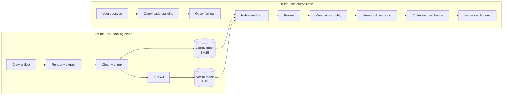
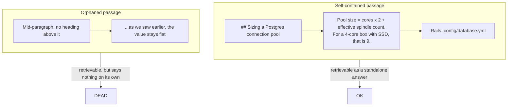
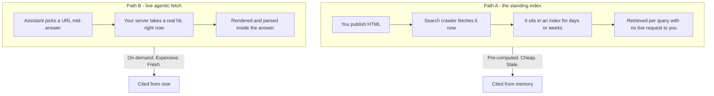
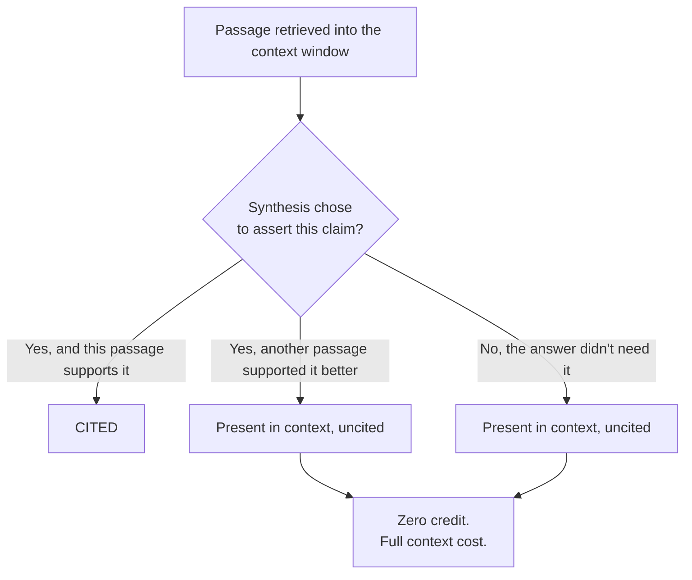

There's a flood of AEO advice right now, and almost all of it is written by people who have never traced a request through a retrieval pipeline.

The advice goes: add FAQ schema, sprinkle statistics, quote authoritative sources, use question-shaped headings, publish an `llms.txt`. Some of that's real. Most of it is folklore, and some of it is superstition being sold at a markup.

The problem isn't that the advice is useless. The problem is that it's advice *about the output* when the actual mechanism operates somewhere else entirely.

I'm a systems architect. When someone tells me a system is misbehaving, I don't start by tuning the copy. I start by drawing the pipeline and finding the stage where the expectation and the reality diverge. So that's what I did with answer engines, and this is the map I ended up with.

## The pipeline, end to end

An answer engine isn't one component. It's two planes, and the gap between them is where almost all AEO confusion lives.

Read that left to right and you'll notice something: **your content passes through a chunker and a renderer before anything about "optimization" even becomes relevant.** A page that isn't renderable, isn't chunkable, or isn't retrievable cannot be rescued by any amount of good writing.

That's the whole game, and most of the popular advice skips the left half of the diagram.

## The indexing plane runs whether you're looking or not

The offline plane is a batch pipeline. A crawler shows up, your server returns something, and that something goes through several filters before it lands in a structure designed to be found by a machine that is not reading it — it's retrieving it.

The stages that actually decide your fate:

- **Render.** The crawler executes JavaScript, and often not immediately. Modern crawlers queue raw HTML, render it later, and compare. If your content only exists after a client-side fetch, you're gambling on the render queue's latency and on whether the rendered DOM is treated as equivalent to your server HTML.
- **Extract.** Boilerplate, nav, cookie banners, footers, and comment threads get stripped. What's left is a linear text stream plus a graph of links, headings, and entities pulled from markup like tables, lists, and definition structures.
- **Chunk.** The stream gets cut into passages. This is the stage I'd argue about hardest, and I'll come back to it.
- **Index twice.** Once lexically (BM25 over tokens — the classic inverted index your site is already feeding without knowing it) and once semantically (a dense embedding per passage, stored in an approximate-nearest-neighbour structure so the query vector can find neighbours in sub-linear time).

Two indices, not one. Which means a paragraph can be findable by exact terminology *or* by meaning, and there's a real class of content that only wins on one axis.

## The query plane fans out, then narrows hard

The user question hits a language model that decomposes it. Google calls this **query fan-out** in AI Overviews and AI Mode: one question becomes a spray of related sub-searches, whose results get blended. Independent tracking puts AI Mode at roughly fifteen citations per answer, AI Overviews around eleven, and the standalone Gemini app closer to seven — which tells you the fan-out depth isn't uniform, and that each surface is genuinely its own retrieval system.

Then retrieval runs hybrid. Lexical scores and vector similarity get fused, and the surviving candidates go through a **reranker** — usually a smaller, more expensive model that reads query and passage together and produces a much better relevance judgment than cosine similarity ever could.

After that, context assembly. Here's the number that should shape everything you write: the context window is finite. Maybe 8,000 tokens, maybe 128,000. The passages that survive reranking get stuffed into it, and if your best sentence on the topic didn't make the cut, nothing you say about optimization matters.

CXL sampled Google AI Overview citations and found 55% of cited passages came from the first 30% of the page, 24% from the middle, and 21% from the bottom 40%. That distribution is not evidence that the bottom of your page is worthless. It's evidence that retrieval is lazy and proximity beats persuasion.

## Chunking is the real unit of ranking

This is the part I think most AEO content gets quietly wrong.

We talk about "pages ranking." Pages don't rank in an answer engine. **Passages compete.** A single 4,000-word article might be chopped into sixty passages, and the engine will happily cite sentence twelve of your post as the authoritative answer to a question you didn't realize the post was about.

That changes what "good content" means. A passage is retrieved in isolation. It arrives in a context window with no memory of the section it came from. So:

The right-hand column is where a lot of beautifully written content goes to die. Not because it's bad — because when the engine cut it out of the middle of a paragraph, the sentence stopped meaning anything.

Practical consequences:

- Headings are load-bearing. They're the only context a chunk inherits about its own subject. `## Sizing a Postgres connection pool` is a chunk boundary marker *and* a semantic label.
- Answer the question at the top of the section, not the bottom. Bottom answers lose to the next heading boundary.
- Prefer definitions, named mechanisms, and concrete numbers. They're semantically dense and survive chunking. An anecdote about my dog doesn't.
- Front-load the entity. Say what thing this is, then the nuance. The embedding isn't subtle about topic; the reranker is strict about whether the passage actually answers the query.

This is why the Aggarwal et al. KDD 2024 paper on Generative Engine Optimization found that adding statistics, quotations, and citations moved visibility up to 40% on its benchmark — and up to 37% on Perplexity specifically. The mechanism isn't magic. Those elements are quotable, self-contained, and dense with the kind of claims an answer engine wants to attribute. A 2026 Hypertext paper formalised something similar and measured structured HTML at 2.6× higher citation rates and 4× higher extraction fidelity than equivalent unstructured content.

## Two retrieval paths, and they need different things

This is the distinction I think causes the most operational confusion, so let me be precise. There are two ways your content reaches an answer, and they have completely different requirements.

Path A is pre-computed. You cannot make it fresher than your last crawl. Path B happens during the answer, which means your server's response time, error rate, and render behaviour are now part of someone's answer.

And the crawler taxonomy is more granular than "AI bots":

| Agent | Purpose | When it hits you |
|---|---|---|
| `OAI-SearchBot` | Builds the index ChatGPT search cites from | Scheduled, off-peak |
| `Claude-SearchBot` | Anthropic's search index | Scheduled |
| `PerplexityBot` | Perplexity's index | Scheduled |
| `GPTBot` / `ClaudeBot` | Model training corpora | Scheduled, bulk |
| `ChatGPT-User` / `Claude-User` / `Perplexity-User` | User-triggered page visits | Mid-answer, synchronous |
| `OAI-AdsBot` | Validates ad landing pages | On ad submission |

The last row of scheduled crawlers (training) and the first two rows (search index) are frequently conflated, and they're independent switches. OpenAI documents them separately: blocking `GPTBot` keeps your content out of training while leaving you fully citable, and blocking `OAI-SearchBot` removes you from ChatGPT search answers while your content still goes to training. The two most consequential decisions on this list are also the two most commonly bungled by a well-meaning "block all AI crawlers" default that someone added in 2023 and never revisited.

Two operational notes from OpenAI's crawler docs worth internalising: they publish IP ranges per bot (`openai.com/searchbot.json` and friends) so you can verify rather than trust the user-agent string, and robots.txt changes take about 24 hours to propagate. So "I blocked it" and "it's blocked" are different states separated by a day.

## Retrieval is not citation

Here's the architectural insight I'd most like people to internalise: being retrieved and being cited are **two separate decisions**, and passing the first says almost nothing about the second.

Your content can be inside the window, have shaped the answer, and receive no link. The attribution step is downstream of the LLM's own choice of which claims to make.

This is where the platform-level asymmetry shows up. A mid-2026 study that analysed 100,000+ prompt responses across 100+ brands found roughly 78% of cited sources were corporate websites, and that the single most-cited content format was the "best-of" listicle at about 21% of all citations. Those two facts are related. Listicles make assertions that are easy to attribute and hard to argue with, because the whole genre is a set of claims in citation-shaped slots.

There's also a ceiling nobody advertises. That same study found a clean tier structure in first-mention visibility: household-name brands appeared in 73% of relevant AI answers on a first run, established mid-market brands in 44%, and niche or small brands in 11%. Roughly thirty percentage points per step. AEO amplifies what already exists. It does not manufacture authority, and if your mental model is "optimise my content and I'll catch up," that model is going to disappoint you at exactly the moment you expect it to work.

## The failure modes are all architectural

Not "SEO mistakes." Structural faults in how content is served.

- **Client-rendered content only.** Served, but delayed through a render queue, and sometimes indexed as a shell.
- **`noindex` left on by a staging deploy.** The most common AEO catastrophe I hear about, and it always has the same shape: a template change, one environment, no catch.
- **Canonical pointing at the homepage.** Completely valid HTML, collapses every passage in your article into one undifferentiated document.
- **Blocking the search crawler while allowing the trainer.** You've paid for model training and bought yourself nothing.
- **Login walls and interstitials.** The crawler gets a 200 and a cookie banner. This is the worst possible outcome: technically crawled, substantively empty.
- **Giant tables with no container.** A 40-column comparison table gets extracted as an unparseable wall of tokens, and so does the sentence you were proud of in row three.
- **Answer text that only exists in an image or a canvas.** Not extracted. Not chunked. Not retrievable. Full stop.

Most of these are the same class of bug as a missing foreign key: not a content problem, a plumbing problem, and invisible until someone traces the path.

## `llms.txt`, honestly

There's a proposed convention where you publish a `/llms.txt` — a markdown map of your site for language models. It got a lot of attention, then a lot of debunking.

The debunking is fair on one specific point: no operator has published evidence that reading `llms.txt` improves citation rates. It's a convention adopted by a critical mass of sites, which is genuinely useful, but it is not a ranking signal and anyone selling it as one is selling a plugin.

Where I think it does earn its keep is different, and it's about the *live fetch* path. When an assistant decides at answer time that your domain looks like the authoritative source for a topic, the difference between a site that hands it a clean, structured map and one that makes it guess is real. It's a routing hint for a machine with limited patience and a hard latency budget.

I publish one on this site, and I also generate `llms-full.txt` — every post as plain text, built from the content collection. Cost: about a minute of build config. Benefit: plausible, unverifiable, and I still think it's worth it because it's cheap and the alternative is being unindexable on purpose. I'll happily be wrong about this.

The honest framing: `llms.txt` is a **content-hygiene practice**, not an optimisation technique.

## Measuring this without lying to yourself

This is where the discipline either shows up or doesn't, and it's the part I find genuinely hard.

The measurement problem is that AEO didn't arrive in a vacuum. ChatGPT's own user base was growing fast the entire time anyone was "measuring AEO lift." So a chart showing AI referrals up 6× tells you almost nothing about whether your changes did anything.

A 2026 natural experiment on this exact problem used a single high-traffic domain and let the untreated remainder of the same site act as a contemporaneous control, which absorbs the platform-level tailwind. Total ChatGPT referrals grew 5.7× while untreated pages on the same domain grew 3.5×. The intervention-aligned effect estimate was 1.82×, with a 95% confidence interval of 1.31 to 2.54.

And then — this is the part I love — a conservative placebo-in-time permutation test came back at p = 0.16. Suggestive, not conclusive, on a short and noisy pre-period. The authors said so plainly instead of shipping the 1.82× as a case study.

That's the level of rigour this field needs and mostly doesn't get. If you run AEO experiments, you need:

- **A prompt panel, not a vibe.** A fixed set of 50 to 200 real prompts, run on a schedule. Prompts are stochastic — the same question sampled five times at temperature 0.7 gives different citations. Single-run comparisons are noise.
- **A control.** Untreated pages on your own domain, so the platform's own growth doesn't get billed to your content strategy.
- **Citation share, not mention count.** A 2026 Hypertext paper proposed **Generative Share of Voice** — your expected share of citations on a prompt, under the acknowledged randomness of retrieval — as a better target than raw mentions. I think that's the right unit.
- **Sentiment tracked separately.** In the same brand study, whether a brand was framed positively or negatively flipped about 6.7× more often than whether it was mentioned at all. Sentiment is the volatile signal. Mentions are the stable one. Optimising mentions and being surprised by tone is a common and avoidable error.
- **Google clicks as a guardrail.** AI Overviews cut clickthrough to the top-ranking result by 58% on December 2025 data, up from 34.5% in April 2025. You are trading something measurable for something less measurable. Know the exchange rate before you make it.

One more number that should reframe your SEO instincts: Moz analysed nearly 40,000 queries and found 88% of AI Mode citations were not present in the organic SERP for the exact-match query. Ranking well for your head term no longer buys you the answer. Those are increasingly separate surfaces.

## What I'd actually do

Not a checklist — a set of decisions, in the order the pipeline imposes.

1. **Serve real HTML with real content in it.** Server-render or static-generate. This is the highest-leverage thing on the page and it's a build-pipeline decision, not a content decision.
2. **Verify the bots by IP, not by user-agent string.** Check your logs, check the published ranges, confirm 200s with actual body content.
3. **Audit canonical and `noindex` across every environment.** Especially the one that isn't production right now.
4. **Decide the training/search split deliberately.** Blocking training while allowing search is a supported, documented position. Doing it accidentally is not a position at all.
5. **Structure for chunk extraction.** One question per `##`. Answer immediately under it. Concrete numbers, named mechanisms, real entities.
6. **Put the load-bearing material high on the page.** Not because deep content is worthless — because retrievers skim.
7. **Claim things that are attributable.** A number, a date, a named source, a mechanism. Those are the sentences that survive a summariser looking for something to cite.
8. **Build the prompt panel before you change anything.** Otherwise you'll never know whether you helped.
9. **Keep publishing things only you can say.** First-hand experience, your own numbers, your own opinions, your own mistakes. In a genre that is converging on identical listicles, this is the only durable differentiator I can identify.

## Where this lands

The entire AEO industry is, functionally, a pile of folk practices wrapped around one real insight: answer engines retrieve passages and attribute claims, so write passages that are worth retrieving and make claims worth attributing.

That insight is real, it's the Aggarwal paper's actual finding, and it explains most of what works. Everything else — the schema dialects, the scoring tools, the promised placement — is downstream noise dressed as architecture.

The part I'd push back on hardest is the framing. AEO is usually sold as a new discipline requiring new tooling, and that framing is a commercial convenience, not a technical one. Nearly all of it is HTTP: return the document, don't hide it, structure it, say something specific, publish it where the crawler can reach it. You already know how to do this. It's called serving a website properly, and it's been the hard part since 1993.

Which is the least glamorous possible conclusion, and I think it's the correct one. The engines got better at reading. The bar for being readable didn't move.

— Yoosuf
