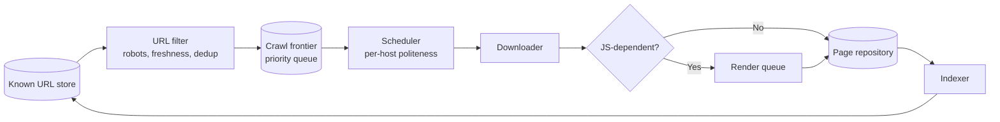
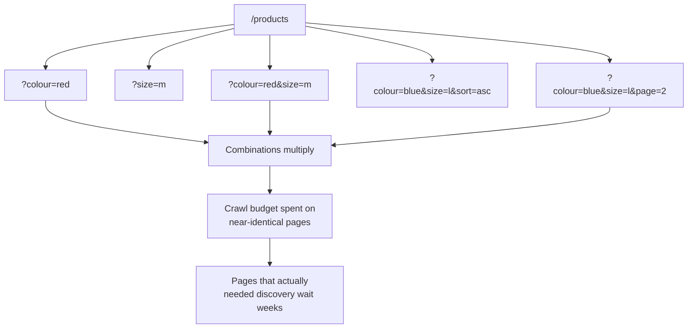
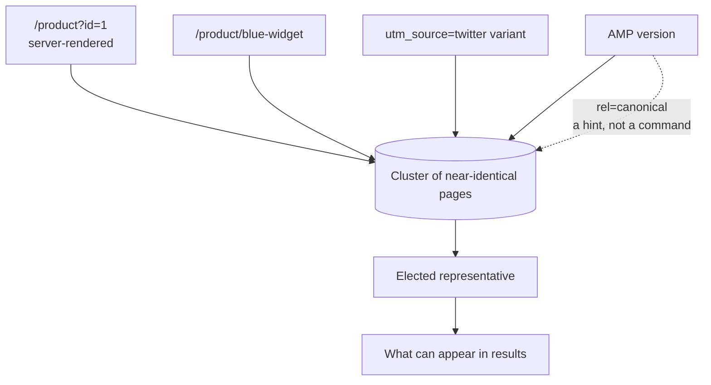
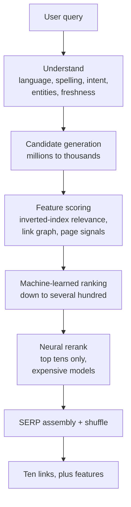
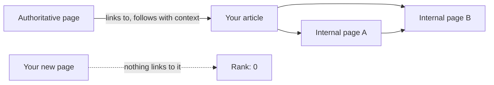
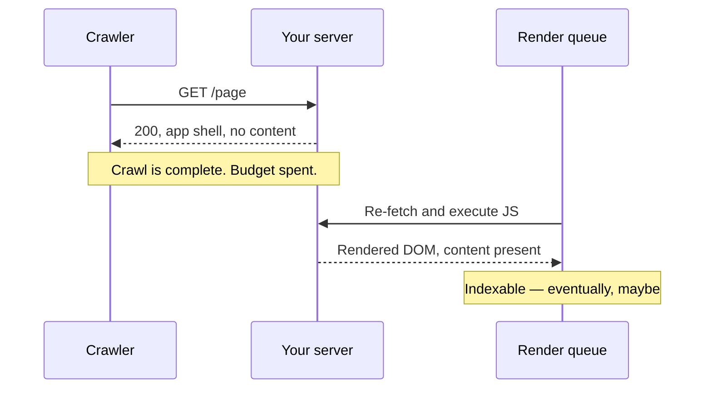
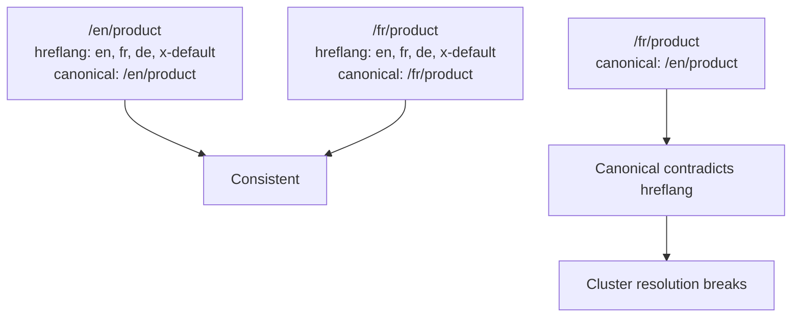

I don't trust SEO advice, and I've never trusted it. Not because the practitioners are dishonest — most are competent — but because the genre has a structural blind spot.

The advice assumes you're talking to a rubric. Add these keywords. Use this heading depth. Put the keyword in the title. Get these seven backlinks. The mental model is a grader with a checklist, and that model is wrong in a specific, predictable way.

It's wrong because there is no rubric. There is a large distributed system, running somewhere you can't see, with a queue, a budget, a stale-data problem, and a cascade of increasingly expensive machine-learned stages. Your page is a message in that system. It gets filtered, scored, maybe dropped, maybe promoted, and eventually either rendered into a list of ten links or discarded without telling you.

Once you draw the actual architecture, about 90% of the folklore evaporates and the remaining 10% makes obvious sense.

## The crawler is a rate-limited distributed system

This is the part I think SEO practitioners underrate most. The crawler is not a program that fetches your page. It's a distributed crawl engine with a priority queue, and your site is competing for a slice of a fixed resource.

The canonical description of this architecture comes from Andrei Broder's 2002 paper *The Anatomy of a Large-Scale Hypertext Search Engine*, and it's worth internalising because every modern search engine still resembles it:

Read that carefully, because it explains most crawl behaviour you'll ever complain about.

The **known URL store** is the graph of everything discovered. The **URL filter** rejects what's disallowed, already fresh, or duplicate. The **frontier** is a priority queue, and — this is the important part — *the priority order is not yours*. You do not get crawled because you published something good. You get crawled because the scheduler's priority function decided your URL was worth the bandwidth, and you do not have a vote.

The **per-host politeness** constraint is why large sites crawl slowly. It's a deliberate throttle so one origin can't monopolise capacity. If you have 400,000 URLs, your own volume is now an argument against you.

And the render queue is a *separate* system with its own backlog, which I'll come back to, because it breaks a lot of confident architecture decisions.

## Your sitemap is a priority queue you write for someone else's scheduler

This reframing is the single most useful thing about the crawl architecture, so let me sit with it.

A sitemap isn't a list for human auditors. It's a machine-readable assertion about which URLs matter, how they relate, when they last changed, and how important each one is. The `lastmod` field isn't a suggestion to a crawler; it's an input to the freshness heuristic. The `<loc>` set is the population you're asking to be scheduled.

Practical consequences that follow directly from the architecture:

- A sitemap that lists 200,000 URLs including every facet permutation doesn't just waste budget. It tells the scheduler your URL space is enormous and low-signal, and you lose the argument on priority.
- `lastmod` that changes on every build is worse than no `lastmod`. A freshness signal that always fires is a signal that carries zero information, and the scheduler learns to ignore it.
- Orphans — pages with no internal link pointing at them — are structurally invisible. They may appear in a sitemap, but the frontier is seeded overwhelmingly from the link graph, and a page nothing links to has no path in.

Google has been explicit that there is no maximum site size and no "page count limit" to optimise around. That's true and it's also somewhat beside the point. The constraint isn't a cliff, it's a gradient. A ten-thousand-page site with clean internal linking gets crawled more thoroughly than a five-hundred-page site where two-thirds of the URLs are duplicates of the other third.

## Faceted navigation is a combinatorial URL explosion

Here's where real-world architectures go wrong, and it's worth drawing because the failure is structural rather than a bug you can patch.

Twelve filters, each with five values, and you've generated a URL space in the billions. Every one of those is fetchable, discoverable via internal links, and returns a 200 with a listing. From the crawler's perspective you've built a distributed denial-of-service attack against your own site.

This is the actual reason faceted navigation needs handling — not because of "duplicate content" as a moral failing, but because you're consuming a shared resource budget and the pager for the important pages is behind you in the queue.

The fixes are boring and architectural, which is the tell: `noindex` on filter permutations, `rel=nofollow` or non-linked JS controls on filter UI, canonical on the clean category URL, disallowing parameter patterns in robots.txt. Choose based on whether you need the pages indexed, but make the choice explicitly rather than by omission.

## The index is not one index

The thing people call "the Google index" is not a database. It's a cluster of specialised indexes, and the partitioning is functional rather than arbitrary — the image index, video index, news index, local index, and the main web index answer different queries with different ranking logic and different latency budgets.

The main web index is an **inverted index**: a map from term to a postings list of every document containing it, with the positions, field weights, and term frequencies attached. It's the same structure a database uses to answer "which rows match this predicate" without scanning them, which is why the whole thing returns in a fraction of a second. Google's own documentation frames the scale as "hundreds of billions of web pages."

Two things about this stage matter for how you work:

**Fields are weighted differently.** A term in the `title` isn't the same evidence as the same term in a footer. A term in an `alt` attribute counts. A term in the anchor text of an inbound link counts, and counts differently again. This is why "put the keyword in the title" works — not as a checklist item, but because title matches get structurally more weight in a fielded postings list.

**Indexing is explicitly not guaranteed.** Google's documentation says it directly: not every page processed gets indexed. A page can be crawled, parsed, understood, and still be dropped. Which means there's a filter between "in the index" and "shown," and the distance between those two states is where most of the frustration lives.

## Canonicalisation is a clustering problem

This one reframes nicely, and Google describes it in these terms: pages with similar content get **grouped** into a cluster, and then one is selected as the most representative. The others are treated as alternates for specific contexts.

So `rel="canonical"` is not a directive. It's a vote you're casting in an election you don't run.

The consequences of "hint, not command" are the ones that bite:

- If two pages point canonical at each other, both are ambiguous and the signal is discarded.
- If you `noindex` a page, Google will ignore its canonical, because a page you've told them not to index can't be elected as the indexable representative.
- If the elected canonical itself is weak, the whole cluster is weak. You've centralised your ranking risk onto one URL.
- A redirect and a canonical are different mechanisms solving an overlapping problem, and using both is the usual cause of the "canonical points to a redirect" warnings.

The genuinely hard case is duplicates that are *intentionally* different — pagination, print views, product variants — where there's no obviously right representative. There isn't a clean answer. You pick one and accept the consequences.

## The ranking cascade is the whole architecture

Here it is. The thing everything else is in service of.

The shape of this is not a secret, and it's not specific to search — it's the same **candidate generation → scoring → re-ranking** cascade that every large recommendation system uses, which Google documents in its own ML material. YouTube's candidate generator reduces billions of videos to hundreds or thousands, exactly the shape here.

Each stage exists because the one before it is cheap and the one after it is expensive. That's the entire design constraint. You cannot run your most precise model over the whole index, and you cannot serve results from an index scan. So you narrow brutally and early, and you spend precision only where the shortlist is small enough to afford it.

Some specifics that are public:

- **Candidate generation** is a fan-out, structurally similar to the query fan-out I described in [the AEO piece](/blog/answer-engine-optimization-architecture/). Multiple candidate generators may nominate different subsets, then get fused.
- **Feature scoring** is where the classic signals live — index relevance, PageRank, freshness, page-level quality.
- **The machine-learned stage** narrows to "several hundred," per Pandu Nayak's public description of the pipeline.
- **The neural rerank** operates on the top twenty or thirty only, precisely because it's too expensive to run on hundreds of candidates. RankBrain is the named system; it was also the first to handle queries Google hadn't previously seen.
- **SERP assembly** isn't just "take the top ten." There's a shuffle stage and layout logic, and SERP features get inserted into positions determined by their own logic.

The architect's takeaway is the one people miss: **because the cascade is cheap-early and precise-late, relevance is decided at a stage where your page is one of thousands, and it can be eliminated long before anything as thoughtful as "is this actually a good page" runs.** No amount of excellent content can recover from being filtered out at candidate generation, because the system never forms an opinion about quality — it just never considers you again.

## The link graph is a graph database problem

PageRank is the original random surfer model: a view of the web as a probability distribution over a directed graph, where a link is a vote and the rank flows.

Two architectural consequences:

**Navigation is a ranking decision.** Every link in your header, footer, sidebar, and breadcrumbs is an edge in a graph computation. A sitewide template link passes authority to the same page on every URL. Sitewide navigation dilutes the signal it carries, and a page linked from everywhere carries no more than one linked from three places, because the graph is about proportion, not count.

**Internal linking is information architecture.** A well-structured hierarchy with a shallow click depth distributes rank to more of the site. A flat architecture of 40,000 URLs linked from a single index page makes every one of them look identical to the graph, which is to say: interchangeable and individually insignificant.

Google has said PageRank has "evolved a lot" since 1998 and remains part of the core systems. Treat "backlinks" as link *acquisition* and internal linking as *architecture*, because they are the same problem at different scales.

## A meaningful chunk of ranking is trained on click behaviour

This is the section the SEO industry skips, and it's the one that changes how you think about the whole thing.

A large family of Google's systems — Navboost and its relatives Glue and Instant Glue — are trained on **user interaction data**: clicks, dwell, reformulations, repeat searches, return-to-SERP behaviour. These have been discussed publicly by Google's Pandu Nayak, who described Navboost as one of the important signals and a kind of memorisation system, with Glue aggregating interaction signals historically and Instant Glue running on a much tighter window — on the order of the last 24 hours, with roughly ten minutes of latency.

Think about what that means operationally:

- **Click-through rate relative to your expected position is an input.** A result that historically gets far fewer clicks than its rank predicts gets demoted, and vice versa. Your title and snippet are therefore part of the ranking feedback loop, not just the presentation layer.
- **Interaction data is normalised per query.** You can't game it by being clickable; you can only be more or less clickable than expected for that specific query.
- **Fresh interaction data is scarce for new pages.** A page with no history gets the prior, not the measurement. This is a real, structural disadvantage for new content, and it's the actual mechanism behind why "publish and wait" works better than any amount of impatient optimisation.

This is also why the SEO advice around clickbait-style titles is more than a user-trust issue. It's a feedback-loop violation. You are optimising a ranking input with a technique that degrades the user outcome the input is supposed to measure.

## The render queue is a separate system and it will disappoint you

"Modern frameworks handle SEO" is the claim I'm most tired of, because it usually means "we send HTML to the browser" and stops there.

The crawler fetches raw HTML. If your content is client-rendered, the fetch succeeds and returns a shell. The render queue then handles it — but it's a distinct subsystem with a distinct backlog and no latency guarantee to you.

So the honest version of the rendering advice:

- **SSG and SSR are the safe answers.** Content is in the response, in the initial HTML, and there is no queue to wait in.
- **ISR is fine** as long as the first response contains content, which it does by construction.
- **Client-side-only rendering is a bet on someone else's backlog.** It frequently works. It's not free, and the failure mode is silent — the page gets indexed as a shell and you find out in Search Console, weeks later.
- **A hybrid shell is a real pattern** (server-render a meaningful subset, hydrate the rest) but it only helps if the *first* paint contains the part you care about.

The other thing about the render queue: it makes rendering cost roughly double, which interacts badly with the crawl budget gradient from earlier. On a large site, that's not a rounding error.

## Core Web Vitals are a distributed measurement system

Here's the part where I think most people, including most SEO practitioners, have the wrong mental model — and the correct one is genuinely more interesting.

Core Web Vitals isn't "your site has a speed." It's an aggregate of measurements taken by **your visitors' own Chrome instances**, bucketed, anonymised, and only surfaced once enough users have contributed.

- **Field data, not lab data.** Lighthouse gives you a synthetic run on Google's hardware. The ranking input is what real users experienced. A 98 Lighthouse score with poor field data means real people had a bad time, and the field data is what's counted.
- **The 75th percentile is deliberate.** Passing means three quarters of your sessions were good, not that the average was good. That's specifically to punish long-tail slow experiences on old devices on bad networks — which is most of your real traffic.
- **There is a privacy floor.** Below a minimum user count, no field data is published at all. Which means small sites can be structurally absent from this signal, and the standard advice to "just run PageSpeed Insights and fix the red number" doesn't work for them.
- **The reporting window is 28 days rolling.** You cannot observe the effect of a change quickly. Any workflow that promises a same-week ranking response to a performance fix is selling something the data pipeline cannot deliver.

Current state, for context: the thresholds are LCP at 2.5 seconds, INP at 200 milliseconds, CLS at 0.1, and they have not moved. INP replaced FID in March 2024, and if your performance documentation still references First Input Delay, it's stale.

Worth flagging, because it's currently circulating and it's false: there are posts claiming Google tightened the "good" LCP threshold from 2.5 seconds to 2 in a 2026 update. Google hasn't. The published number is still 2.5, and they have said to expect the definitions and thresholds to be stable with changes on prior notice.

And the weighting, honestly: page experience is a page experience signal, not a primary one. Google's own framing of the page experience update was that it is not a single ranking signal, and the underlying metrics are best understood as a **tiebreaker between pages of comparable content quality**. Roughly 55% of origins now pass all three, per the January 2026 Chrome UX Report data, so if you're in the failing half this is real work. If your LCP is 2.4 seconds and your traffic is flat, the threshold is not your problem and buying a faster agency will not fix it.

## Structured data is a declaration, not a lever

Let me be direct about this, because schema markup has accumulated a lot of cargo cult.

JSON-LD structured data does two things: it makes your content machine-interpretable in a way that's genuinely useful for entity extraction, and it makes you **eligible** for rich results. That's it. It is not a ranking signal, and no amount of schema on a page with no authority behind it will do anything for visibility.

The most common misuse is marking up things that aren't visible on the page. Google's guidelines are explicit that structured data should represent content a user would see, and marking up invisible content is a violation that can cost you a manual action. It's a shortcut with a real downside, not a free upside.

The architectural case for schema is different from the marketing case: it's the most explicit machine-readable statement you can make about what a thing is, and that's worth having in a world of ambiguous HTML. Do it because it's correct, not because it bought you position last time.

## Internationalisation is distributed configuration

`hreflang` is the one genuinely distributed part of SEO, and it's where good architectures go wrong most reliably.

The requirements are mechanical and strict: annotations must be **reciprocal** (if the English page lists the French one, the French page must list the English one), each page must **self-reference**, and you need `x-default` as a fallback. And it composes with canonical in a way that produces the classic footgun — hreflang and canonical must point at consistent URLs, or you end up with a canonical that contradicts the alternates and the cluster resolution goes unpredictable.

The failure is not always visible. You can get a page that indexes fine, ranks fine in one locale, and quietly never surfaces in the other — which is exactly the bug that's miserable to diagnose six months later.

## What to measure, and what to distrust

The measurement architecture is weak, and knowing which parts are load-bearing saves a lot of time.

**Log files are ground truth.** Your server logs record every crawl hit: the user agent, the status code, the URL, the response time, the byte count, the timestamp. You can compute your own crawl distribution, find your slowest pages, count how many times bots hit your 404s, and see exactly which parameters crawlers are exploring. It's unglamorous and it answers questions nothing else does.

**Search Console is authoritative but heavily sampled.** It's a lossy window into the index. It tells you what Google believes about your site, which is genuinely valuable, but it is a sample and it is not a census. Treat it as a health check, not a measurement instrument.

**Rank tracking is a simulation.** Third-party tools re-run queries against a set of locations and devices. The engine is stochastic and personalised, so a rank number is an estimate with a wide error bar, not a fact. It's useful for tracking *relative movement over time*. It is not useful for day-to-day decisions, and anyone treating a one-point rank change as a signal has misunderstood what they're measuring.

**Traffic is the lagging indicator of all of it.** And it degrades for reasons outside your control — seasonality, algorithm updates, and increasingly AI answers taking the click without taking the visit.

The habit I'd actually build: watch your own server logs for crawler behaviour weekly, and treat Search Console coverage as an error report. Fix what the logs tell you is actually broken before optimising anything the tools have opinions about.

## The uncomfortable part

A few things I believe that cut against the industry:

- Most SEO work is really **distributed-systems hygiene** with a marketing surface. Duplicate content is a caching and canonicalisation problem. Crawl waste is a queue-depth problem. Slow templates are a resource-contention problem. None of these are content problems and none of them are mysterious once you see the pipeline.
- Most ranking factors are **not things you control directly**. Links are a social outcome. Authority is accumulated over years. Interaction signals are a consequence of whether your page satisfied someone. The controllable surface is smaller than the industry's product pricing implies.
- The **feedback loop is real and it's mostly virtuous**. Write something genuinely useful, someone lands on it from search, they stay, they come back, the interaction data improves the ranking, more people see it. That's the whole game and it needs no tricks. The tricks are mostly attempts to short-circuit a loop that only runs once, at the cost of the thing the loop measures.
- And the honest one: **SEO is not a channel you own**. You never had it. You were always a guest in someone else's distributed system, whose capacity decisions, crawl budgets, and model weights are all outside your control. The best strategy is to make your pages cheap for that system to fetch, understand, and trust — and then to be surprised less often.

## Where this lands

Search is a system that reads the web continuously, compresses it into an index, and then answers questions by narrowing from millions of candidates down to ten through a cascade where the cheap decisions happen first and the careful decisions happen only for the survivors.

Your job, in architectural terms, is to make sure your pages survive every stage: discoverable, not blocked, renderable, non-duplicate, canonical, fast enough to pass a tiebreaker, and structured enough to be interpreted rather than guessed at. Almost none of that is writing. Almost all of it is delivery.

The folklore gets the ordering wrong. It tells you to optimise the content and assume the delivery will follow. The architecture says the opposite: **delivery decides whether the content is ever read.** A page that isn't crawled, isn't rendered, or isn't canonical never gets to have its quality assessed by anything.

Which is, in the end, the same lesson the AEO piece arrives at from a different direction. The engines got better at reading. The bar for being readable didn't move.

— Yoosuf
