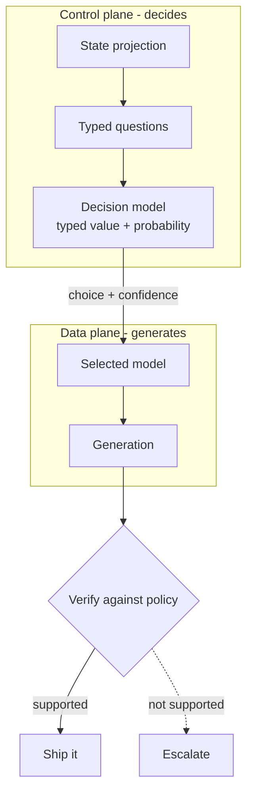
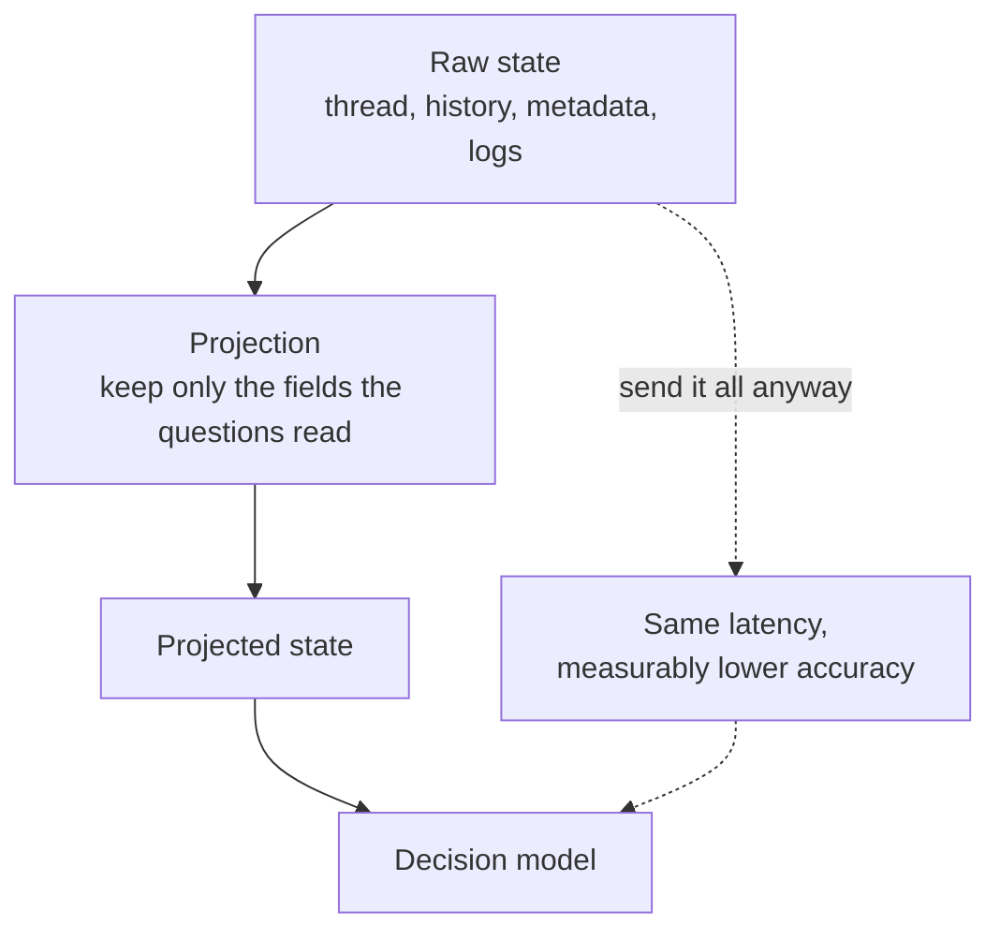
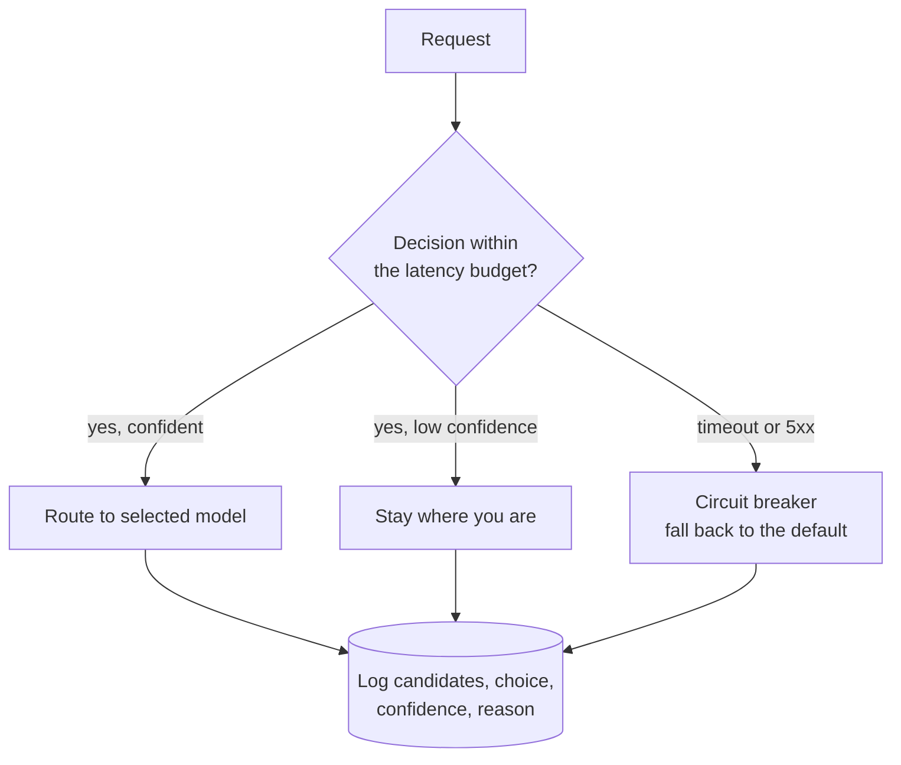
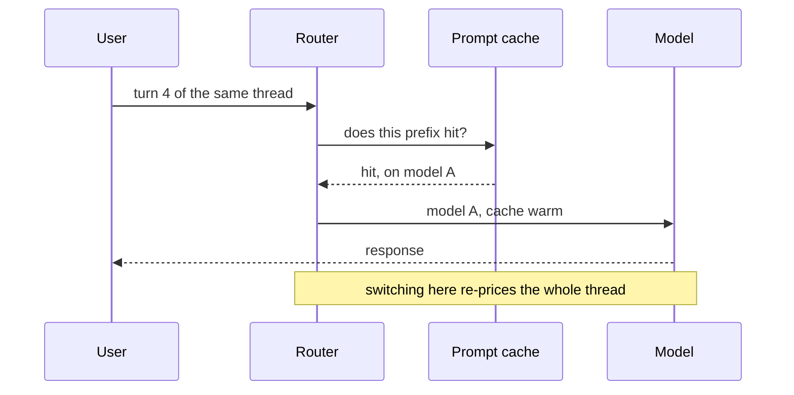

Two weeks ago, TypeSafe released a model that cannot generate text. This week, OpenRouter wired it into the routing path for ordinary LLM calls — reported by PANews via Gate and Phemex, integrated as `typesafe/jev-router` with cache-aware selection, so a request can pick its model and its inference intensity per turn.

That's the news. The part worth your afternoon is what it means that the thing doing the routing can't write.

I've reviewed enough agent systems that my default reaction to a new routing layer is "where's the fallback". So I went and read the docs, the launch post, the evals, the pricing, and — because this is exactly the class of claim that deserves it — the independent benchmark numbers. Then I read TypeSafe's own "Nuance" sections, which turned out to be the most interesting thing they published.

## Routing was always a control-plane problem

Here's the reframe. Almost every "LLM router" you've used is middleware sitting in the request path: it inspects the request, picks a model, forwards the bytes. It looks like part of the data plane because it lives in the data path.

It isn't. It's a control plane. The generation is the work. The routing is a decision about the work, and decisions have completely different engineering requirements than work: they need a confidence signal, a failure policy, an audit trail, and someone who owns the threshold.

The whole game is the left box. Everything interesting about routing as a category has always been control-plane work — evaluation harnesses, cost curves, abstention policies, drift. The data plane is a solved problem you rent.

What changed is that the decision is no longer a string you scraped out of a completion. It's a typed value with a probability attached, produced in 70 to 500 milliseconds for $0.042 per million input tokens with output billed at zero.

## Three primitives, and that's the entire type system

[Jev](https://docs.typesafe.ai/introduction) answers three kinds of question, and you can mix all three in one call:

- **Choice** — pick one of your keys. Returns the key, a probability for every key, and a confidence value. Cardinality goes up to 255, above which TypeSafe scores independently and then makes an explicit choice.
- **Score** — where does this fall on an ordered set of levels you describe? Returns the probability-weighted average position, a legend mapping each index to its description, per-level probabilities, and confidence. Capped at ten levels.
- **Noul** — what's the probability this proposition holds? One number. No separate confidence field, because the number *is* the answer.

No free text. No reasoning trace. No JSON body to parse, no schema validation, no retry loop for a malformed tool call. If your pipeline ends in `JSON.parse` followed by a `switch`, that shape is exactly what this replaces — and OpenRouter's own framing of it is that you swap the model, keep the LLM for the branch that needs prose, and measure both.

The cost shape deserves a second look, because it's structurally different and not obviously a bargain. Generative models charge heavily for output, roughly 5x input on typical pricing. Jev bills input only, because the output is a distribution over a set you defined, and the sets are small. A three-question support-ticket call runs about 450 input tokens, which OpenRouter's writeup puts at roughly two thousandths of a cent. A million tickets of that shape: about $19.

You are not buying intelligence. You're buying a function call with a probability attached.

## The schema is also the prompt, and your key names aren't in it

This is the detail I think most teams will trip over, and it's one line in TypeSafe's API reference: **the question id is never sent to the model.** When you write `team: { type: 'choice', ... }`, the string `team` does not reach Jev. Only the `instructions` and the `criteria` do.

So all the meaning lives in the descriptions. Which means:

- Your variable names are invisible. `intent` versus `primary_topic` versus `q1` makes zero difference to the output. Only the prose does.
- Criteria are read literally, so they have to be written like a specification, not a label. OpenRouter's example spends a full sentence per option explaining exactly which customer complaints fall in it.
- A refactor that renames a key is a no-op. A refactor that *tightens a sentence* is a model behaviour change, and it will show up in your routing distribution with no deploy, no commit, and nothing in your changelog.
- Irrelevant detail in the state measurably lowers accuracy. TypeSafe documents this as jaggedness, and OpenRouter's guidance is blunt: send only the state each question needs.

That last one turns out to be the most consequential, so I'll give it its own section.

## Confidence is not accuracy, and the numbers move

Two properties of the output that will bite you, both documented, neither widely discussed.

**Confidence measures concentration, not correctness.** TypeSafe derives confidence from the shape of the distribution, not from whether the answer is right. A model that puts all its weight on one option scores 1.0 whether it's right or confidently, catastrophically wrong. Confidence tells you how torn the model was between the options you offered. Whether those options are the right set is entirely your problem.

**The same input returns different numbers on different calls.** OpenRouter documented this by accident, which is the best kind of documentation. The same muddy billing ticket returned `billing` at 0.79 with confidence 0.69 in one run and 0.84 with confidence 0.77 in another. A severity Score came back 1.15 on one call and 1.19 on the next. A refund Noul on a deliberately ambiguous message returned 0.52 and then 0.49 on the verbatim same text.

That second property is the one that changes your code. You cannot write `if (confidence > 0.8)`. You have to write bands, because a point threshold on a distribution that moves between calls is a coin flip near the boundary. The practical shape:

- High confidence: act automatically.
- Middle band: this is a *third outcome*, not a coin toss. Ask a follow-up, or send it to a person.
- Low confidence, or a Noul hovering near 0.5: the model is telling you it doesn't know, and that's the most valuable thing it will ever tell you.

The Noul-near-0.5 case deserves emphasis. A customer who wrote "there are two charges on my card this month, if one of them is a mistake, what are my options?" has not asked for a refund. Jev correctly declined to pretend they had — 0.52, then 0.49. A pipeline that thresholds at 0.5 and then *acts* on that would have refunded a customer who didn't ask. The right read is that 0.5 is a routing signal, not a boolean.

## Projecting state is the real engineering

If irrelevant detail degrades accuracy, then a decision plane forces a new stage into your request path that you didn't have before: a projection, per question set, of the state each question actually reads.

The 32,000-token context window is not a budget you get to spend. It's a liability, because everything you put in it is competing with the signal.

This is the same shape as the chunking problem in [the AEO piece](/blog/answer-engine-optimization-architecture/) — the unit that gets judged isn't the document, it's the passage that was retrieved. Here the unit that gets judged is the projected state, and if you can't explain which fields a given question reads, you don't have a projection, you have a habit.

Two more constraints that are architectural rather than model-shaped: Jev takes text only (no images, audio, or video), and it is explicitly not the place for arithmetic, counting, or date comparison. Compute those first, hand it the semantic remainder. "Is this order late" is a question for your database. "Does this customer sound like they're about to churn" is a question for Jev.

## The numbers, including the inconvenient ones

OpenRouter ran a triage benchmark on 60 support tickets across five intents plus an escalation flag, and a prompt-injection screen on 40 messages, all through the same API on 19 September 2026. Small sets, one prompt, one day — the shape of the tradeoff rather than a leaderboard, which is the correct way to describe it.

Ticket triage:

- **Jev** — 59/60 intent (98.3%), 60/60 escalation, 194ms median, 633ms p95, $0.0248 per 1,000.
- **GPT Luna** — 59/60, 60/60, 1,106ms median, $0.0921 per 1,000.
- **Claude Opus** — 60/60, 59/60, 1,957ms median, $2.88 per 1,000.

Prompt-injection screening: Jev 40/40 at 194ms median and $0.0161 per 1,000; Luna 39/40; Opus 40/40 at $1.5889 per 1,000. Injections scored 0.86 to 0.99, ordinary messages 0.01 to 0.20. That's a clean separation, and it's the kind of margin a threshold can actually sit in.

But the number in that writeup matters more than the accuracy figures, and it's the strongest argument for confidence existing at all. Jev misfiled exactly one ticket — a question about splitting a refund on a returned item — and filed it under *return or refund* at a confidence of 0.56. It was the only ticket in the run below 0.8. A 0.8 threshold would have sent it to a person, so the pipeline got the case right *because of the confidence signal* while the accuracy metric reported a miss.

That's the whole argument. **Aggregate accuracy is the wrong metric for a decision plane.** What you care about is the error rate inside the band where you act, and only calibration gives you that number.

Now the independent numbers, which are more interesting because they're less flattering.

A community effort benchmarking Jev as a router on [RouterArena](https://github.com/RouteWorks/RouterArena) (ICLR 2026) reported two results. On a 13-model flagship pool via LLMRouterBench — 11,668 queries, zero inference cost because it routes by lookup against precomputed answers — the router hit 62.4% at $26.73 per 1,000 against GPT-5's 60.3% at $31.55. Or 60.3% at $21.09, which is best-single accuracy at 33% lower cost. Both are genuine routing wins on a strong, heterogeneous pool.

Then the ablation. The same pipeline with Jev removed and replaced by a retrieval prior scored 62.4% at $26.69. Identical. The authors' own conclusion: the win came from the retrieved neighbour evidence, not from the decision model, and Jev's difficulty signal was "largely redundant" on this benchmark.

And on the three-cheap-model pilot, nothing beat `gemini-2.0-flash-001` on its own — 77.1% at $0.048 per 1,000, cheapest and most accurate simultaneously, which is a position no router can improve on because every misroute is a pure loss. The README puts it better than I can: routing only pays off when no single model dominates the pool. That's a property of the pool, not of the router.

The same report contains the most useful number nobody in this space talks about: the **oracle** — the cheapest model that got each query right — sits at 82.6%. The router reached 62.4%. Twenty points of headroom, and the authors correctly identify it as a model-*recall* problem rather than a difficulty-estimation problem. Almost all the remaining value in routing is knowing which model to pick, not knowing how hard the question is.

If you're building a router, that's your roadmap. Not a better classifier. Better recall of which model wins on requests like this one.

## The reference standard is the actual benchmark

TypeSafe's launch post has a "Nuance" section under every claim, and it's the most useful page they published, because it's a benchmark-design confession.

The workflow evals don't have ground truth. They use the predictions of the largest and most expensive external models as reference probabilities — specifically the average of GPT-6 Astra and Fable 5.1. TypeSafe states plainly that this "biases answers towards OpenAI and Anthropic's models" and that they likely underestimate their own model relative to DeepSeek's. The latency figures were measured from laptops on the West Coast, where the service currently lives. On cost: "we can't prove it isn't subsidised." And the hallucination comparison was run through OpenRouter, where, in their words, "more complex queries might be routed to better models" — which means the baseline got a quiet quality upgrade the challenger didn't.

None of that makes the claims false. It makes them *incompletely verified*, in a specific and locatable way, and I respect that far more than the usual launch post which simply omits the caveats and lets you assume.

The transferable lesson is the one I keep landing on in [the search piece](/blog/how-search-works-architecture/): the measurement design is the system, and the ranking of the results is downstream of choices somebody made about what counts as ground truth. A benchmark that defines truth as the average of two competitors' opinions is measuring agreement with those two models. It may still be a useful signal. It is not accuracy, and it should never be reported as accuracy.

If you're evaluating any router — including this one — the question to ask is not "how accurate is it" but "who defined correct, and would they have defined it this way if a competitor had won."

## Your decision plane needs a failure policy

Here is the part almost nobody writes down. A decision model is a network dependency in front of a dependency you already had, it's probabilistic, and it's a third party. When it is down, slow, or unsure, the system must do something deliberate.

AutoJev's own model-routing guidance is the cleanest statement of the policy I've seen, and it's worth reading as a template:

- Remove candidates that violate context, residency, permission, or budget constraints *before* asking anything.
- Keep the current or safe default model when the decision service fails.
- Avoid downgrading when low confidence, or a large cached context, makes switching risky.
- Record the candidate list, the selected model, the confidence, and the fallback reason.

Four things I'd add to that, from having been on the wrong side of this:

- **Give the decision call a smaller timeout than your end-to-end SLO.** A 194ms median with a 633ms p95 is fine. A 194ms median with an unbounded tail is a latency incident you'll attribute to the model, because that's where the token count is.
- **Log the signals, not the state.** Log the request id, the question names, the probabilities, the threshold you applied, and the outcome. OpenRouter's guidance on this is explicit: keep the `state` out of the log, because tickets and documents are full of customer data. A router log is a compliance liability the moment it stores prompts.
- **Ship it in shadow mode first.** This is the pattern I trust most, and it's what `opencode-jev-router` does by default: run the decision, log what it *would* have done, act on nothing, and measure disagreement against your human labels for a couple of weeks. Then promote. Every router I've seen launched by flipping the switch on day one, and every one of them learned its thresholds in production.
- **Decide now what happens on a data-residency conflict.** The open-source LiteLLM routers are explicit that routing sends a minimised summary of your request to a third party, and they fall back to local behaviour with no key configured. If you have data that can't leave a region, your decision plane has to be deployable inside it. That constraint will determine your vendor list, and it's cheaper to find out before you've routed a customer's medical records through a routing API.

## Cache-aware routing is the constraint nobody mentions

The OpenRouter integration is described as cache-aware: it detects cache hits from the context in order to avoid redundant computation and token waste. That's a small clause in a news item and it's the most important architectural detail in the whole deployment.

Because provider-side prompt caching is keyed on the token prefix, **model choice is not a per-request decision, it's a per-context decision.** A router that optimises each turn independently will change the model mid-thread, invalidate the prefix cache, and pay full price for the entire conversation again — on every turn where it disagrees with the previous choice.

So the routing policy has to be sticky within a context, and the cache hit rate becomes a first-class metric alongside cost and quality. This also quietly caps how clever routing can get: the cheapest correct model for turn nine is not worth re-paying for turns one through eight.

I'd expect most router evaluations to miss this entirely, because the public benchmarks route one-shot queries where no prefix exists. It's the same blind spot as the Jevons problem in a different costume, and I expect it to be the thing that decides whether per-turn routing survives contact with real agent workloads.

## The Jevons part

TypeSafe named the model after W. Stanley Jevons, and the reasoning is stated in the launch post: steam efficiency didn't reduce coal consumption, it increased it. Every order of magnitude drop in the cost of intelligence, they argue, unlocks orders of magnitude more use cases.

That's usually read as a growth thesis. As an architect I read it as a *demand* thesis, and it's the bit that should worry you.

A decision that costs two thousandths of a cent is not a decision you make once. It's a decision you make on every tool call, every permission prompt, every routing hop, every retry, every output, on every request. The economics don't make the bill smaller, they make the *number of decisions* explode. Nobody's cost model is built for the volume they're about to generate.

Which means the interesting question stops being "is routing cheaper" and becomes "how many decisions can I afford to make, and who reviews them." A pipeline that today makes four model-driven decisions per request will, at this price, make forty, and every one of them is a place where a wrong answer is silent. The failure mode isn't an exception. It's a confidently wrong route that nobody sees until a customer complains.

## What I'd actually build

Concrete, and short, because the pattern is not complicated:

- **One switch statement first.** Find the LLM call in your codebase that ends in `JSON.parse` and then branches. That's the first candidate, and it's the cheapest to measure. Leave everything else alone.
- **Shadow before you switch.** Log the decision, compare it to your labels, and only then let it act.
- **Project the state per question set**, and write down which fields each question reads. If you can't, you don't have a projection.
- **Thresholds as bands, not points**, derived from a few hundred of your own labelled examples, and re-derived every time you edit a criteria string.
- **Sticky routing per context**, with cache hit rate on the same dashboard as cost and quality.
- **Fallback that doesn't need the model up**, plus a log full of probabilities and none of your customers' data.
- **Measure cost per correct decision.** Cost per request is the metric that made everyone optimistic about routing in the first place, and it's the one that hides the failure.

## The uncomfortable part

A few beliefs that cut against the launch:

- **The routing win is real and it isn't Jev's.** The strongest independent result came from retrieval evidence, and the ablation matched it to within a rounding error. That's not a criticism of the model; it's a statement about where the value is in routing generally.
- **A 20-point oracle gap means the hard problem is recall, not judgement.** Everyone optimising their classifier is working on the easy half.
- **Calibration is a property of the aggregate, not of your request.** A model that's right 80% of the time at 0.8 confidence is still wrong one time in five, and your escalation path has to be sized for that, not for the marketing number.
- **"Can't hallucinate" is true and narrower than it sounds.** It can't emit a type error because it emits no text. It can absolutely be wrong about which of your options is correct, confidently, with a probability attached. Type safety moved the failure from loud to quiet, and quiet failures are more expensive.
- **And the structural one:** a router that picks your model is picking your quality floor, and nobody is on the hook for that floor. When the cheap model handles the hard prompt and the answer is subtly worse, there is no exception, no stack trace, and no alert. It just shows up as a support ticket about the product getting dumber, six weeks later.

## Where this lands

A decision plane is a new kind of dependency. It sits in front of a model you already depend on, it's probabilistic, it's somebody else's server, and its failure mode is a confidently wrong answer that looks exactly like a right one.

The technology is genuinely interesting. The early numbers look real, the cost curve is a different shape from anything in the stack, and the fact that it can't generate prose is a much bigger deal than it first appears — it removes an entire category of bug that we've spent two years building frameworks to tolerate.

But the thing that decides whether it's good engineering is the boring part. Project the state. Threshold in bands. Fall back without it. Shadow before you switch. Log the signals, not the data. Measure cost per correct decision.

Routing was never really about picking the best model. It was about owning the decision. Jev just made the decision a first-class object with a probability attached to it — which means the parts that were always the hard part are now the entire product.

— Yoosuf
