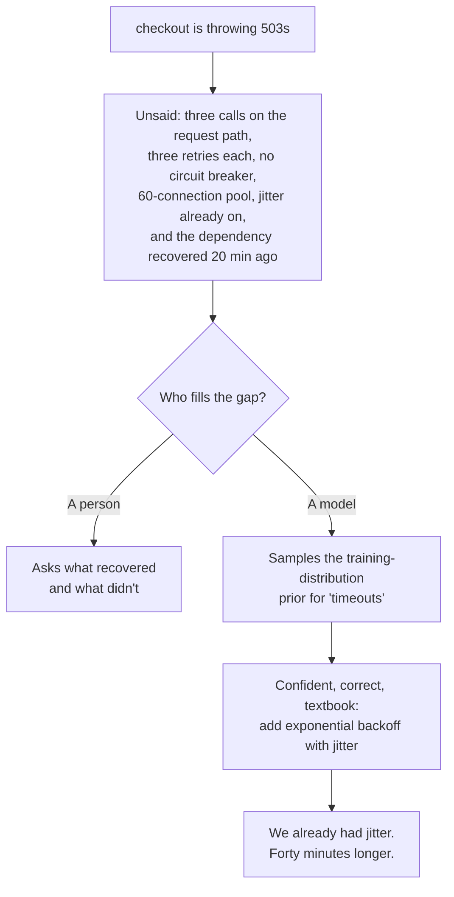
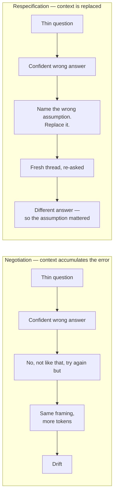

There are three questions in this post that I asked badly. Two cost me an afternoon each on this site. One cost a checkout platform about forty minutes of downtime, and the advice I was given while it was happening made it worse.

That's the whole post, and I want to be precise about the mechanism before I get to the advice, because most advice on this topic explains the symptom and stops there.

## The forty minutes that made it worse

We ran a checkout platform. Order intake, payment authorisation, fraud scoring, inventory reservation, and a notification fan-out downstream. Normal, boring, load-bearing.

At about 4am, latency on the fraud-scoring service crossed a threshold. Nothing dramatic — the service was slow, not down. Response times went from 40ms to 3s over roughly ten minutes, and checkout request latency followed it up.

Fraud scoring recovered about twenty minutes later. Checkout did not. It kept failing for another forty.

The first thing we tried is the part worth writing down. Someone asked for help diagnosing the 503s and got back a confident, correct, textbook answer: add exponential backoff with jitter to the retry on the fraud-scoring call.

That is genuinely good advice. It's what the AWS SDK guidance says, it's what Stripe's writeup on the subject says, it's in the SRE book. Retries without jitter really are a defect, and ours were missing it.

We already had jitter. Adding more of it changed nothing, because jitter was never the problem.

What was actually happening: checkout made three downstream calls on the request path, each with a three-retry policy, and there was no circuit breaker anywhere in the path. One inbound request could therefore put nine calls in flight, and every one of them held a connection from a pool of sixty for as long as it waited. The pool supported about six genuinely concurrent requests. Everything above that number queued on the same sixty connections.

Checkout wasn't slow because fraud scoring was slow any more. Checkout was slow because it had spent its own capacity waiting on a dependency that had already moved on. And when fraud scoring did recover, the pool was still full of retries queued against deadlines measured from moments that had already passed, which is what the extra forty minutes were.

The real fix was four things, and "add backoff" was not one of them.

- A circuit breaker on the fraud call, so a dependency slow for more than about two seconds stopped being called at all
- A retry budget — a hard ceiling on the fraction of requests permitted to retry, per service, which caps amplification structurally instead of trusting the dependency to be healthy
- Deadline propagation, so every layer inherited the remaining budget from its caller instead of starting its own ninety-second clock
- Moving two of the three downstream calls off the synchronous path entirely. They never needed to be synchronous. They'd been synchronous because that was how the first version got written, and nobody revisited it because it worked

Only the last one actually reduced the blast radius, and it cost an afternoon of arguing and a rewrite of the service contract. The other three were a day's work.

Now here's the part that matters. Nothing the model said was false. Backoff without jitter is a real anti-pattern and our retries genuinely had jitter. The answer was a correct answer to a *retry* question, given to a system whose problem was that it had no circuit breaker, no retry budget, no deadline propagation, and a synchronous dependency it didn't need.

Nobody could have inferred any of that from "checkout is throwing 503s." That information lived in a service graph four hops deep, in a client library's default configuration, and in a design decision about which calls sat on the request path that a previous team had made and nobody had revisited. That is precisely the category of thing a model cannot know and a human never thinks to mention.

## Two more, at a much smaller scale

The outage is from a few years back and none of it is in this repo. These two happened during the rebuild of this site, and both are now permanent rules in `AGENTS.md` — which matters for reasons I'll come back to.

I'm including them because the same shape shows up at completely different scale, and because the second one is the case that actually changed how I write questions.

**The reset that ate the stylesheet.** During the Tailwind removal I asked for a preflight-equivalent reset. The model produced one, and every rule in it was correct. But it was unlayered, and unlayered CSS outranks *every* `@layer`, so a plain `h1..h6 { font-size: inherit }` silently destroyed both the `.prose` typesetting and every compiled StyleX atom.

Read that one carefully, because it's instructive. The reset did exactly what I specified. It was a correct answer to a question I hadn't finished asking. The specification was the defect.

**The animation that measured clean and felt worse.** The subtler of the two. I'd built a per-element stagger, each hero child fading up on its own index, while `main` also faded. Every automated signal was green. CLS was zero. The animation completed. No long tasks, no rAF gaps. And it still read as a *jerk* — the headline stayed invisible for roughly 230ms while the page slid underneath it, which is the compound-motion problem, and it was worse than either motion alone would have been.

The fix was deleting the per-element animation and keeping one opacity fade on `main`.

That second one is why I take this seriously enough to write it down. The checkout outage had a dashboard screaming at us. This one had a green dashboard and a bad feeling in my gut, and the only instrument that caught it was me watching the thing load a hundred times and getting irritated. **The distance between "the model gave a confident answer" and "the answer addressed my situation" can be invisible to every tool you own, including the tests you wrote to catch exactly this.**

That is not new, and I want to be careful here. Fifteen years of this has taught me that the most expensive defects have never been the ones that were loud. The loud ones are found in staging by whoever was brave enough to break it. The expensive ones survive review because everyone on the review was looking for the same class of bug nobody thought to look for. A model makes that worse, because it produces a *finished-looking artifact* faster than a tired human does, and a finished-looking artifact passes review more readily than a rough one.

The scale of the system is not the variable. A thin question is a thin question whether it's a CSS reset or a payment path.

## The model samples; it doesn't ask

Here's the mechanism underneath all three.

When you ask a person, the missing 80% gets filled in socially. You tell someone "can you look at the checkout service?" and they already know which calls are on the request path, that the fraud provider was slow last Tuesday too, and that "look at" means twenty minutes and not a quarter. All of that arrived free with shared context. They'd either ask you two questions or make an informed guess and tell you the guess, and either way you'd find out what they'd assumed.

A model has none of that. Not a little. Zero. It doesn't know your service graph, that you already added jitter, that the dependency recovered twenty minutes ago and you haven't, or that a colleague is in the incident channel with you right now. It has no memory of yesterday and no access to your infrastructure unless you put it in the context.



The default is not *ask me to clarify*. The default is the mode of the training distribution. For "checkout is throwing 503s" that mode is a decade of Stack Overflow answers about flaky dependencies, which is precisely why the reply felt so right when I read it.

That's the bit I want to land, and it took me embarrassingly long to see it. **It wasn't hallucinating.** It did exactly what the weights say, which is answer the most common version of your question with the confidence of someone who's certain, because the distribution has no way to express uncertainty about *which question it just answered*.

A malformed request throws. An underspecified one returns something fluent and structurally perfect to a question you didn't ask — and nothing in the output marks it as having been invented.

## What the folklore gets wrong, specifically

Three things I get asked about constantly, with what the evidence actually says.

**Role prompts.** "You are a senior engineer with fifteen years of experience." There's a real effect and it's almost always described incorrectly. It shifts the register of the output and moves the distribution the model draws from. It does not add fifteen years of experience to a system that has none. The advice sells a capability injection; what you actually get is a sampling shift. Useful for tone, useless for correctness, and the conflation of the two is most of why it disappoints people.

**"Think step by step."** Real evidence behind it, much narrower evidence than the folklore. Sprenger et al. ran a meta-analysis across a hundred-plus papers using chain-of-thought, then evaluated twenty datasets across fourteen models themselves, published at ICLR 2025. CoT gives strong gains on math and symbolic reasoning, small gains elsewhere. On MMLU, direct answering matched CoT almost exactly: **95% of the benefit came from questions containing an equals sign.** Much of what CoT buys is better symbolic execution, and a symbolic solver beats it at that.

On a cascading-failure question it buys verbosity. Current frontier models reason by default when a question looks like reasoning, so you're paying for a wall of prose you have to skim to find the sentence you needed.

**More instruction is better.** This has now been formally retired by the people who ship the models, which makes it the most persuasive evidence in the entire post. OpenAI's current guidance says shorter outcome-first prompts beat process-heavy stacks, and that older prompts tend to over-specify process because *earlier models needed more help staying on track* — which on current models adds noise, narrows the search space, or produces something mechanically obedient. The GPT-5 guide goes further: vague or contradictory instructions are *more* damaging to a strong model than a weak one, because it burns reasoning tokens trying to reconcile a contradiction rather than picking one and moving on. Anthropic's position is identical from the other direction. Smarter models need less prescriptive engineering.

So: the advice got worse as the models got better. Almost everything published in 2023 was calibrated against systems that genuinely required the scaffolding, and it's still being handed to people as current.

Where the folklore does work, the mechanism is far less mystical than advertised. Simon Willison's phrasing is the accurate one: "LLMs are incredibly good at imitating things, and at rapidly picking up patterns from very limited examples." That's not prompt engineering. That's showing your work. If you can paste the actual client config instead of describing it in a paragraph, paste the client config.

## Which parts of this are still true in two years

This is the question I actually care about — and almost nobody writing about prompting asks it, because it's unglamorous and it doesn't sell a course.

I have watched a lot of methodology advice arrive, be obviously right for about eighteen months, and then quietly become folklore. The pattern is consistent enough that I distrust anything I can't date. So here's the test I'd apply to this entire post, and you should apply it to the advice you're being sold:

**If a piece of advice would still be true of a very smart new colleague who joined this week and had never seen a token, it's durable. If it only makes sense as a lever on the sampling behaviour of a specific model generation, it's a lease, and it's already expired on half of it.**

By that test, the role prompt, the CoT incantation, effort levels, temperature folklore, and the entire "prompt engineering is a discipline" framing are all leases. They'll look quaint the way "you should write unit tests" looks quaint to anyone who now has a model — which is to say, not quaint, just unnecessary in the way the old manual process became unnecessary.

The durable half is duller and I have more confidence in it: close the gap a human would have closed socially, name the constraint that changes the answer, and check what comes back against reality rather than against plausibility. That's true of a colleague. It was true of a senior engineer in 2011. It'll be true in 2031, and it has nothing to do with the vendor.

## A question is a specification, and specifications have parts

The practical part. Not all of these belong in every question; the skill is knowing which one you're skipping.

1. **The constraint that changes the answer.** Not your constraints, the one. A model that knows the dependency recovered and the service didn't produces a categorically different answer than one that doesn't, and your other nine constraints are competing for the same attention. Anthropic's framing is right: find the smallest set of high-signal tokens that maximises the likelihood of the outcome you want.

2. **What you already tried, and what happened.** Nobody writes this, because to a human it feels like you're doing the work yourself. But "we already have exponential backoff with full jitter on the fraud-scoring client" removes the default answer outright and hands over a hard negative. It converts a generation problem into a diagnosis problem, and diagnosis is the part these systems are genuinely good at.

3. **Where the answer goes.** This decides register more than any "be concise" instruction will. An incident channel, a postmortem, a migration plan, and a design doc for whoever inherits it next quarter are four different artefacts. Naming which one costs eight words.

4. **Evidence you can check.** Versions, config, the actual query plan, the number you measured, a timeline. Ground truth in the context is what prevents a plausible value being invented to fill a gap you left.

5. **Your real bar for being wrong.** "Roughly right, this is a throwaway" gets a different answer than "this is a production incident and I have to defend it in the review."

Here's the same question, both ways. Same person, same ten minutes of thought — the second isn't longer so much as more complete.

Thin:

```text
checkout is throwing 503s, look at it
```

Specified:

```text
Checkout p99 went 400ms -> 12s about 40 minutes ago. We're returning 503
from roughly 4% of requests. No deploy in that window.

The fraud-scoring dependency recovered about 20 minutes ago. Checkout has
not. That's the part I can't account for.

What I know about the path: three downstream calls on the request path,
each with a 3-retry policy, no circuit breaker anywhere. Connection pool
is 60. Jitter is already on, from the SDK default.

I want to understand why checkout didn't recover when the dependency did.
Not a list of everything that can make latency spike - I can read that.
If the connection pool is the bottleneck, say so and tell me what to look
at to confirm it. If it isn't, tell me why not.
```

Same knowledge, completely different answer. The reason isn't length. It's that the second version leaves nowhere to guess. And the last line is doing real work: it explicitly invites a *no*, which is the only way to find out whether your stated theory is the problem.

Note what the thin version is missing. Not the service graph — that's obvious. The missing part is the *asymmetry*: the dependency got better and we didn't. That one sentence is the question. Everything else is context to support it, and the answer changes completely without it.

## Who gets paged

This is the test I use — and the most useful thing in the piece for anyone who owns a system rather than a script.

Before you send a question, answer this one: **if the answer is wrong, who finds out, and how long does it take them to find out?**

If it's you, in your editor, in five minutes, then a thin question costs you an afternoon. That's the case the folklore is written for, and it's why the folklore feels like it's about you.

If it's a customer, or a person on call at three in the morning, or a colleague who's now blocked on your branch, then the thin question isn't an inconvenience. It's a deployment with your name on it, and the cost of being wrong scales with blast radius, not with how well you phrased the ask. The four o'clock checkout is the pure version of this. Nobody who has carried a pager for a year finds it surprising, and everyone who hasn't learned it the expensive way.

Why this matters now, and didn't five years ago: the *cost of a bad answer* went down while the *cost of a bad answer reaching production* did not. Writing a bad query used to require me to know enough SQL to be embarrassed into checking it. Now I can get a plausible, well-formatted, subtly wrong answer for something I've never written by hand — and the tools that would catch it are exactly the tools I was too slow to use before. The friction was doing QA work, and I was too impatient to notice.

## Ask it to argue back, or you've hired a flatterer

If I could keep only one habit from all of this, it'd be this one — the single move that turns a confident answer into a usable one.

Append a disconfirming instruction. "Be critical" won't do it. That's a vibe, and it produces a paragraph of mild hedging that you learn to skip. Name what you want attacked:

- "Before answering, list the two assumptions here that would most change your answer, and tell me what you'd need in order to check them."
- "What would make this diagnosis wrong?"
- "Give me the strongest argument against the answer you're about to give me."

OpenAI ships a version of this as a documented mitigation in its GPT-5.2 guide: if the question is ambiguous or underspecified, ask one to three precise clarifying questions, or present two or three plausible interpretations with clearly labelled assumptions. The vendor is telling you the default behaviour is the problem.

The test I'd actually use: **if you get a confident answer and no pushback at all, suspect the question.** Not always. Some questions really are clean. But on a genuinely contested problem, the absence of a specific objection is itself the signal, and it's the same signal a confident colleague gives you when they haven't actually looked yet.

This is the argument [the Jev piece](/blog/jev-decision-model-routing/) makes about abstention, arriving from the opposite direction. A system that never tells you the question is wrong will cheerfully produce a well-structured response to a badly-shaped request, every time, at length.

## Context is a budget, and your question is competing for it

The window grew enormously. The fact that more is worse did not change.

Chroma's context rot report tested eighteen models and found performance degrades consistently as input grows, with the detail that matters more than the headline: those same models are dramatically better on focused inputs than on full ones containing the same relevant material. The drop isn't a capability ceiling, it's the extra retrieval step that irrelevant context forces the model to perform. Liu et al.'s *Lost in the Middle*, TACL 2024, found the same shape from the other side: best when the relevant material sits at the beginning or end of the input, worst when it's buried in the middle. Anthropic's framing is the economic one. A finite attention budget with diminishing returns.

Three consequences for how you ask:

- **What you paste competes with the question.** Send what the question reads, not what exists. This is the same projection argument [the Jev piece](/blog/jev-decision-model-routing/) makes about a decision model, and the same chunking argument [the AEO piece](/blog/answer-engine-optimization-architecture/) makes about a retrieved passage. Three layers, one rule: the unit that gets judged is the smallest thing that answers the question.

- **Position is nearly free.** If you're sending a lot, put the question and the constraint at the top and the reference material at the bottom. Costs nothing, and it's the difference between your instruction being read and being buried mid-haystack.

- **The long thread is the worst context you'll ever send.** Forty turns deep with the real question buried in message two. The model has been reasoning on partially-irrelevant state and you can't see it from in there. If an answer is drifting, the cheapest fix isn't another corrective turn. It's a fresh thread with the question and the relevant state, asked again. Costs one paragraph, works far more often than people expect, because much of the drift is accumulated context rather than a misunderstanding.

## Why good questioning fails anyway

Zamfirescu-Pereira and colleagues gave ten people a purpose-built tool for systematic prompt design at CHI 2023 and watched them use it. They didn't iterate systematically. They explored opportunistically, tested locally, and mostly didn't check whether a later edit reintroduced an error they'd already fixed. The stated barriers: "expectations stemming from human-to-human instructional experiences, and a tendency to overgeneralize."

That's not a finding about a tool or about models. It's a finding about the wrong mental model being imported, and it's the thing I'd most want an engineer fifteen years in to take from this post.

Asking questions is a social skill, and we get good at it for social reasons. We learn that "how's the checkout service?" is a good question, because the person we're talking to supplies the rest. So we learn the *shape* of a good question. Short, trusting, elliptical, unburdened. Then we carry that shape to something with no idea what your service graph looks like.

The folklore makes it worse, because most of it is confident specific advice that sounds as though it should work. So you apply the shape. You try the trick. It doesn't land. And because the failure looks like a failure of the tool, the lesson gets permanently filed against models rather than against the question.

Nobody has ever optimised a social skill and then plugged it into a channel with no social layer in it. What transfers isn't the shape of the question — it's closer to writing a ticket for a stranger, which is a much less glamorous skill and the only one that was ever load-bearing.

## The loop is the artefact, not the prompt

The real discipline isn't a better first message. It's what you do in the bad turn — and the first message will be bad sometimes.

Most people respond to a bad turn with "no, not like that, do it again but…" and it's the worst thing you can say, because you're negotiating inside a drifting context and every turn adds more of the wrong framing. The alternative is a respecification: name the specific thing that's wrong, replace it, re-ask.

- Bad: "No, not like that, more like the other approach."
- Good: "That assumed the timeout was a retry problem. We have jitter and the dependency already recovered while we didn't, so the retry path isn't the thing. Redo it around why recovery didn't propagate, and tell me what you'd need to see to rule that out."

Same instinct, different operation. One adds a complaint; the other swaps a constraint and re-runs the problem. The answer changes completely, which tells you the constraint was load-bearing. That's information you bought for a paragraph.



Two habits, both cheap:

**Keep the ones that worked.** When a question lands, save it. When it doesn't, save that too, with what was wrong. You aren't iterating if you can't tell whether your last change fixed anything.

**Run it twice when it matters.** Same question, fresh context. If two runs disagree on the thing you care about, the question was under-specified, and you found the ambiguity by accident.

The `AGENTS.md` at the root of this repo is the accumulated version of both. Every entry in Gotchas is a constraint that couldn't be inferred: the reset has to live inside `@layer base`, `color-scheme` must never go on `body`, don't reintroduce the hero stagger, keep mermaid rendering deferred. That file is three months of asking badly, itemised — and it is the single most useful document in the project. I mention it because it's also the honest answer to "how do I get good at this." You get good at it by writing down what was missing at the moment you lost it, and then reading it back the next time.

## The uncomfortable part

Things I believe that cut against my own post:

- **"It was my prompt" is a story you tell yourself about half the time.** Every bad answer is explicable as an underspecified question, and plenty of them would have been bad with a perfect one, because the model doesn't know things no prompt can tell it. Framing well doesn't manufacture knowledge. The honest version of this advice is that it hands you a plausible-sounding excuse for failures that had nothing to do with your phrasing, and I've used it more than once.

- **A better question makes a wrong constraint more dangerous, not less.** If you specify "this must retry idempotently" and the truth is "this call is not idempotent," the tight spec produces a *more* confident, better-structured wrong answer, because you removed the ambiguity that was acting as an alarm. The disconfirming ask isn't a nice-to-have. It's the only thing between a tight spec and a confident mistake, and that's precisely why a tight spec makes it more load-bearing, not less.

- **A well-specified question against a broken foundation gets you to the wrong answer faster.** Most of the time "the model is giving me bad answers" is a missing migration, a stale mental model of your own system, or a problem with three legitimate answers where you like one. Spec discipline surfaces that quickly. It doesn't fix it, and it keeps the fix disguised as a wording problem right up until it isn't.

- **And the one I'd sit with.** You are not getting better at thinking. You're getting better at writing down what you were already thinking. The constraint, the thing you tried, the bar it has to clear. That's a real skill and worth having, but it's a *writing* skill, and the model is a mirror. If you can't write the question, the part you can't write is usually the part of the problem you hadn't actually resolved. Which means the most useful prompts you'll ever send are the ones where writing them teaches you something you didn't know.

## Where this lands

Ask a model well and you're doing two things: closing the 80% of context that a human would have supplied socially, and forcing yourself to know which 80% that is. The second is the actual skill. The first is a side effect.

Every piece of advice in this genre is a distorted version of that. Be specific → say what you mean. Give it a role → understand you're shifting a distribution, not conjuring expertise. Think step by step → if the problem is symbolic, use a solver. Show an example → yes, because imitation is real and it's the cheapest mechanism available.

The folklore was calibrated to 2023 models that genuinely needed the scaffolding. Subtract the scaffolding and you're left with a much older discipline in new clothes: writing a specification for a component with a finite budget, no shared context, and no way to tell you it misunderstood you.

The embarrassing part, which turns out to be the useful part, is that nothing on that list is a prompting technique. The constraint. What you tried. Where it lands. The bar. Those are the contents of a brief you'd write for a senior engineer starting on Monday, and the reason they transfer to a language model is that they were never about the language model.

Fifteen years of architecture is mostly learning which parts of a system are load-bearing. That's what the four o'clock checkout was about — not the retry, which is the part everyone knows, but the pool and the breaker and the two calls that never needed to be synchronous. This is that skill, pointed at a new component. The component doesn't matter much. The habit of writing down what you're actually asking for, before you find out what you actually got, is the whole thing, and it's the one part of this post that won't be stale in two years.

— Yoosuf
