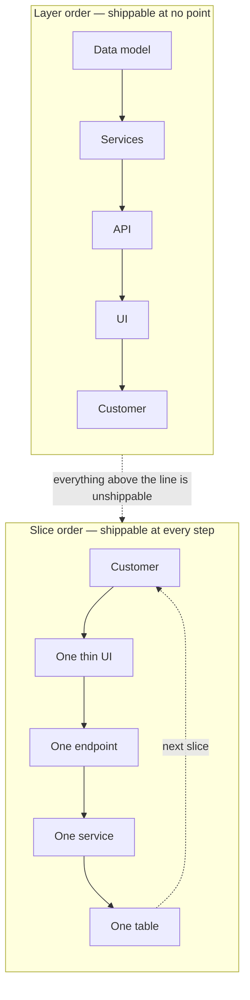
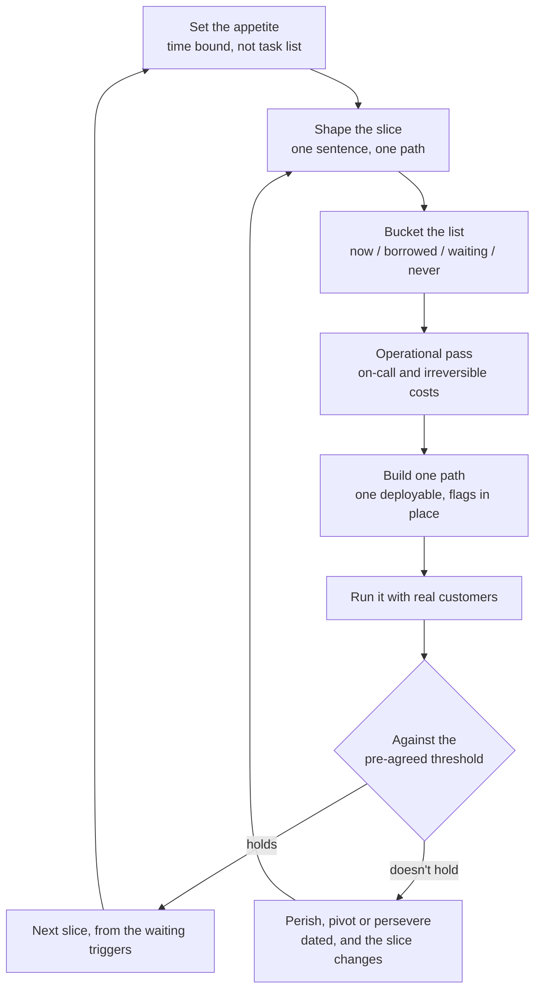

I wrote about this from one direction a week ago: [when building gets nearly free, the MVP stops being a scope problem](/blog/how-to-make-an-mvp-in-the-ai-era/) and becomes a learning problem. The build is cheap, so stop and run the experiment.

This post is the other direction, and it's the one I run into more. You have a system with a lot of features. The architecture is good. The vision is coherent, everyone's convinced, the domain model is genuinely necessary for what the product is *for*. And nobody — including the people who wrote the vision — can tell you what the first release contains.

That is a different failure. The cheap-build version of this problem is a discipline problem. This one is closer to a political one, and architecture is only half the answer.

## The features aren't the problem. The feature list is.

A feature list is not a description of a release. It's a record of every argument anyone has ever won about what the product is *for*. Twenty features usually means twenty conversations where someone convinced a room their idea was load-bearing. Every one of those conversations was locally reasonable. Collectively they're a document nobody would have written on purpose.

The mechanism is old enough that Brooks named it in 1975. The second-system effect, from *The Mythical Man-Month*: the moment you get a first version working, the temptation is to build version two with everything you thought of and didn't build the first time. The first system survives because it was small. The second system dies because it's a wishlist wearing an architecture. He called the result a "design loss" — the thing was more general, more flexible, and it still failed, because general is not what a user needed.

You'll see the same force in Gall's law, which is worth printing next to any product vision: a complex system that works is invariably found to have evolved from a simple system that worked. Evolved. Not designed top-down from the finished diagram.

So the reframe I'd start with: the features you haven't cut yet aren't backlog, they're unspent test budget. Every one of them is a causal claim — that if you build the reporting module, or the roles system, or the two-way sync, customers will do the thing that makes this a business. You have not tested a single one of them. Cutting isn't losing. It's refusing to spend money on an untested guess dressed up as a plan.

## Cut by actor, not by feature

When a system has too many features, the reliable cut is almost never "do less for everyone." It's "serve fewer people properly." The reliability comes from the economics: cutting a feature breaks somebody's use case, cutting an audience breaks nobody's, because nobody had it yet.

The companies that shipped narrow first all did the same thing. They picked one small set of humans and gave them the whole product, and every feature on the list either served that set or got cut.

| Company | What the first release actually was | What came later |
| --- | --- | --- |
| Facebook | Harvard only, February 2004. A profile: a photo, your school, a relationship status, a wall. | Other schools one at a time, then the newsfeed, search, chat, groups, video, pages, the Like button five years in |
| WhatsApp | One phone number per contact and text messages. January 2011. | Groups took about two and a half years. Voice and video calls took five |
| Slack | Internal chat at a game company that had run out of internal chat. Public beta 2014. | Files, calls, canvases, workflows — and a decade later, being out-scaled by a suite that bundled chat for free |
| Stripe | A charges API for developers, 2010. | Customers, then Connect, Billing, Radar, Treasury, Issuing, Tax |
| Notion | Public launch 2018: pages made of blocks. | Databases and their views, which are the reason people call it Notion today |
| Linear | Issues, projects, cycles. 2019. | Views, integrations, an AI triage agent, a mobile app |

Look at the right-hand column and notice what it is. It's not a list of bugs, and it's not "the MVP plus some bugs." Each of those is a feature that was a load-bearing part of somebody's original thesis about the product, and every single one of them was wrong at launch and right later.

WhatsApp is the cleanest version of the whole lesson. The people who would eventually want groups, voice notes, and business accounts were not early users of a messaging app. They were a *later* segment, and the only way to find them was to be excellent at the first segment long enough to have a company. Two and a half years of being one thing is not a delay. It's the research.

## Ship a slice, not a layer

Here's the engineering half of the question, and I think it gets underrated because it's phrased as an engineering choice when it's really a scoping choice.

The instinct when you look at a big system is to start at the bottom: build the data model properly, then the services, then the API, then the UI. This feels rigorous. It's the ordering that makes the system reviewable, and it produces a beautiful foundation that has never met a customer.

A layer is not shippable. A database schema with no interface can't be used. An interface with no persistence is a prototype. An API with no consumer is a guess about a protocol that will have to live forever because somebody depends on it. Every layer you build before the user-facing path is a place where scope can re-enter and a place where you find out about the problem too late to change the shape.

Ship one complete path through the whole system instead. Not a feature — a path. A real person starts at the top, and every layer participates.

Notion's first release is a good concrete case. Databases — the thing everyone now means when they say Notion — were not a thin version. They didn't exist. The slice was a block editor on pages. Databases came a year later, and the reason they worked when they arrived is that a year of real documents had shown which structures kept recurring. Notion didn't guess the data model. It got handed one.

A few rules I'd hold to when choosing the slice:

- **It has to end in a changed state.** If nothing persists, you don't have a slice, you have a demo. The user must be able to point at something afterward.
- **It has to be the one thing the product is for.** Slack's slice was chat. It was emphatically not email, and it wasn't "messaging plus files plus calls plus search plus everything a workplace needs." If the slice needs a second adjective, it's two slices.
- **It has to be describable in one sentence a customer could repeat to a colleague.** I use this as a hard test, because it's a proxy for whether you have a scope or a wishlist. If you can't compress it, you don't have a product yet, you have a pitch deck with a launch date on it.

## How do you honor a deferred feature without building it

This is the part most scoping advice skips, and it's where releases die. You cut a feature, tell the team it's out of scope, and then two months later somebody asks how the product handles the case the feature handled — and the honest answer is "badly, silently." So the feature comes back. It always comes back, because the conversation about it was never finished.

The move is to decide *how* the deferred capability is served before you cut it. Not with a stub. With a substitute that's honest about being manual.

| The feature you're deferring | What ships instead |
| --- | --- |
| Automated rules engine | One operator runs the rules by hand, once a week, and documents what they did |
| Role-based permissions | Two hard-coded roles, chosen at signup. If you need a third, that's a bug report |
| Third-party integration | Forward the email to a human and process it in a spreadsheet |
| Self-serve onboarding | A 30-minute setup call with every customer. Do it ten times before you automate it |
| Configurable layouts | One opinionated layout that is right for the segment you chose |
| Native mobile app | The one mobile web screen people actually use |
| Real-time updates | A refresh button. It's not embarrassing, it's honest about the scale you have |
| Forty notification types | One digest email, daily |
| Bulk operations | The API and a script you run yourself |
| Audit log | Postgres. Don't build a table and an admin screen for it yet |
| Multi-currency | One currency. Multi-currency is a tax-liability feature wearing a UX costume |
| Granular undo | A support engineer with a database client and a good attitude |

Nothing on the right-hand side is clever. All of it is defensible in front of a customer, which is the actual requirement. The reason this works is that the substitutes are cheap to keep honest and expensive to keep quiet — you can't pretend the manual path doesn't exist, because you, personally, are doing it.

And the two-and-a-half-years figure from WhatsApp is the payoff. A manual substitute collects the exact information you need to design the real thing, and it costs almost nothing. It's [concierge delivery](https://basecamp.com/patio/doing-concierge-research), a technique from 37signals long before the word "MVP" became a genre of blog post, and Paul Graham gave it the memorable name [Do Things That Don't Scale](https://paulgraham.com/ds.html). A founder doing the work by hand for twenty customers learns more in a month than a spec review produces in a quarter.

## Four buckets, and the one nobody uses

When I sit down with a team and a list of forty features, I make them place each one into one of four buckets, in writing, on a board, in one sitting. The exercise takes ninety minutes and it's the highest-leverage thing in this whole post.

- **Now** — the slice. One path, end to end. If it's not in this bucket it isn't in v1.
- **Borrowed** — served by a manual substitute. The value is real, the automation is deferred. This is the bucket that saves you.
- **Waiting** — not built, with a stated trigger: the evidence that would move it up. "Ten customers ask for it" or "we pass 500 accounts" or "retention drops at week two." The trigger has to be observable by someone who isn't the person requesting the feature.
- **Never** — not in the plan, in any form, for the foreseeable future.

That last one is the bucket teams skip, and skipping it is why scope regrows. The backlog is where dead ideas go to be re-litigated every quarter with a new champion and no memory. A feature lands in **Never** only once, with a written reason, and the reason is the durable part. "The customer's legal team won't allow it," "the operational cost is a person we can't hire for," "we already have a better answer in the roadmap" — those hold up. "Not a priority" holds for about six weeks.

**Waiting** entries are the ones that leak. A deferral with no trigger isn't a decision, it's a promise to argue again later, and you will argue again later because the original argument was never resolved. Write the trigger at the moment of deferral, when you're not personally invested in the feature.

I wrote about the discipline this needs in [perish, pivot, or persevere](/blog/perish-pivot-persevere/): pick the move and the date before you run the experiment, so that the person whose feature is being cut isn't the person deciding whether it comes back. The bucket exercise is that same discipline applied to a list instead of a single bet.

## Make deferral reversible, but don't build for it

Two engineering rules, and they're in tension, which is why teams get one of them wrong.

**Make the cut reversible with a toggle, not a migration.** A deferred feature that's switched off at runtime is a config change. A deferred feature that's switched off by not having the table requires a migration, and a migration that a future team has to reverse is a different and much more expensive thing. Martin Fowler's [Feature Toggles](https://martinfowler.com/articles/feature-toggles.html) pattern is about flags as deployable configuration, and the specific advice I'd add is the boring part: put the flag mechanism in before you need it, because retrofitting flags across a few hundred tables is a project of its own, and by then the codebase is shaped around not having them. Google's [feature flagging best practices](https://cloud.google.com/architecture/feature-flagging) is worth reading mainly for the pitfalls section, which is mostly a list of ways flags become permanent code that nobody dares delete. A flag that has been off for six months isn't a deferred feature, it's a dead branch with a deployment strategy.

**Do not build the seams for what you cut.** This is where MVP money goes to die, and the pull is strong, because deferring a feature makes you anxious about the shape you'll have to add later. So you build a generic permissions model to hold the two roles you actually need. You build a rules engine to express the one workflow you have, configured in a schema, so the second workflow needs no code. You build a plugin interface because you'll have integrations eventually.

You won't. What you'll have is one role boundary expressed as a permissions framework, one workflow expressed as a workflow engine, and a plugin API with no plugins. Every one of those is a real cost paid in the currency you can't get back, and none of them is a bet. Generalization for known-future cases isn't architecture, it's a guess with a clean abstraction in front of it. Hard-code the one path. A boolean flag, not a framework.

Two more things I'd insist on, because they're cheap now and expensive later:

- **Keep the modular monolith.** Slice by feature inside one deployable. Fowler's [Monolith First](https://martinfowler.com/bliki/MonolithFirst.html) is the argument, and the practical version: a service split before you have volume doesn't give you microservices, it gives you a distributed monolith with network partitions and a distributed transaction problem you chose for yourself. The v1 workflow should not need three services to agree to commit.
- **Store what you received, model what you understand.** If your MVP parses three of the eight fields in an incoming webhook, keep the raw body and don't throw the other five away. Same with the event log, the API response you can't parse yet, the manual CSV export your first ten customers need. Every one of those is a place where the deferred feature otherwise needs new instrumentation and a re-implementation later. This is the one place I'd pay for speculative generality, because it isn't a seam — it's a column, and it can't be reconstructed after launch.

## Every feature is an on-call shift

Product scoping and operational scope are the same number, and teams almost never price them together.

A feature that can fail at 3am requires someone awake at 3am. An MVP team is small, usually has one person who can debug production, and frequently doesn't have a rotation at all. So a v1 that includes self-service data export needs a support person who can reason about partial failures in a format you designed. A v1 that includes account deletion needs someone who can answer a regulator. A v1 that includes payments needs reconciliation, disputes, and chargebacks — which is a customer-facing product all by itself, built in the background, forever.

Rank your features by support cost the way you rank them by build cost. A feature that costs three days to build and creates a class of 2am pages has a real total cost that isn't three days, and the class of things you can carry is much smaller than the class of things you can build.

The specific version of this rule: **the irreversible things don't get MVP versions.** They get done versions, or they get a human in the loop. Shipping half of account deletion is worse than shipping none, because now you have an obligation you can't meet. Ship "close my account," and a person fulfils it. There is no shame in that and there are a lot of early companies doing it.

## The part that argues back

Let me put the other side up properly, because scope discipline is one of those things that quietly becomes dogma.

**A narrow release changes who you can sell to, permanently, at least for a while.** It's a positioning decision disguised as a technical one, and the feature you cut may be the exact thing your next hundred customers are choosing you over a competitor for. Choosing a slice chooses a customer. That's fine — it's a real strategy, and 37signals built an entire book around it, [Getting Real](https://basecamp.com/gettingreal), published free in 2005 because "most software is written for a customer who doesn't exist yet." But it's a bet, not a law, and it should be made as a bet.

**The narrowest possible product can be a trap.** Superhuman reportedly passed a hundred million dollars in ARR on an invite-only, keyboard-first mail client with essentially no self-serve onboarding. That's a real business, and it's also two years of growth that had to be fought for, product or no product. The people who needed it most were the people who couldn't get in.

**And the cost of cutting doesn't stay paid.** Eric Yuan built Zoom on this — the eight rules in [*The Zoom Startup Handbook*](https://www.zoom.com/en/blog/author/eric-yuan/) (2019) include "don't be afraid to release a bad product" and, more usefully, "compete on the market, not on the product," which is precisely the instruction to a team drowning in features. Zoom then grew into a platform with a sprawl of products, a Rooms business that needed its own service org, and privacy problems that a smaller company would not have had the surface area to create. Narrowness bought them the market. It didn't stay a strategy.

Slack is the same story with a harsher ending: a decade of being genuinely excellent at one thing, and then the incumbent bundled chat into a suite they already owned. The narrowness was correct for ten years and it stopped being a moat. Build the platform eventually — the thing to avoid is mistaking the launch for the destination.

The process that survives contact with this is Amazon's, and it's the one I'd hand a team in this position. [Working Backwards](https://www.aboutamazon.com/news/company-news/working-backwards-from-the-customer-experience) and the Bryars' writeup of it: you write the press release for the release before you build it. No numbers in it. Then you hand the release to someone who wasn't in the room and they tell you what it is. If the press release has to explain which features are coming later, you haven't scoped anything — you've written a changelog. If the press release is embarrassing in its narrowness, the scope is wrong and it's much cheaper to find that out on a page of prose.

One more warning about this whole genre, because the post I linked to at the top makes it: Gmail was labelled "beta" from 2004 until 2016. Twelve years. So don't let "beta" become a euphemism for "we're not ready to decide." The label was harmless because the scope was a real, complete product for a defined user, just not for everybody. A narrow product with a beta badge forever is not a v1. It's a v0 that has stopped asking for permission.

## The shape of the decision

So here's how I'd actually run the room, in order. Most of it is [Basecamp's Shape Up](https://basecamp.com/shapeup) (2019, free), which is the best published treatment of scoping a fixed appetite, and the rest is ordinary architecture.

1. **Write the slice in one sentence, in the customer's words.** If it takes a second clause, go back to cutting actors, not features.
2. **Put a bound on it first.** Two weeks or six weeks, fixed. Time, not tasks, because tasks are the estimate you're trying not to make yet. Shape Up's version is an "appetite" set before the work is known, and the sentence it enforces is the useful one: cut scope, not quality.
3. **Bucket all forty features.** Now, Borrowed, Waiting with triggers, Never with reasons. Ninety minutes, one board, everyone who has an opinion in the room.
4. **Ask what happens operationally for each of the first three buckets.** The on-call pass, the irreversibility pass. This is the step that removes features nobody was arguing about.
5. **Build the slice as a path, in one deployable, with the toggle mechanism already in place.**
6. **Decide on a date, against a threshold, with the person who wants the cut feature absent from the room.**

That loop is the same one from [the AI-era piece](/blog/how-to-make-an-mvp-in-the-ai-era/) and the same one in [perish, pivot, or persevere](/blog/perish-pivot-persevere/): bind the experiment, run it, decide against a number on a date, decide again. The scope work only matters because it makes the loop cheap enough to run more than once.

The last piece of the exercise, which I'd do before any of it, is a pre-mortem. Everyone in the room writes two hundred words imagining it's six months later and the narrow release failed. Not "we ran out of money" and not "the market disappeared" — the boring operational answers: nobody activated, the one workflow was the wrong one, the manual substitute turned out to be 30 hours a week, the audience we chose had no reason to tell anyone. Read them aloud. Roughly a third of them will be about something you could still fix by cutting two more features, and that's the whole point of doing it while there's still a board full of things to cut.

## What a first release should look like

The bar, when I put it in one place: describable in a sentence, sellable in a screenshot, supportable by one person at 3am, and honest about what's missing.

That last one does more work than the other three combined. The reason a narrow product gets recommended is that whoever used it could say what it wasn't good at and the person hearing it still believed them. A v1 that quietly fails at the edges teaches people to distrust you at the one moment you need them to tell their friends.

I don't have a tidy ending for this one, because I don't think it has one. What I'd say is this: a feature list is a record of arguments you won, not a plan you wrote, and the people who shipped narrow first — Facebook with one school, WhatsApp with one kind of message, Slack with one conversation — didn't have less ambition than you. They had a bigger bill to pay attention to.

The vision is the thesis. The release is the experiment. Every feature you didn't ship is a dollar of budget you kept, and the only way to lose the system you designed is to ship it before you know whether anyone wants it.
