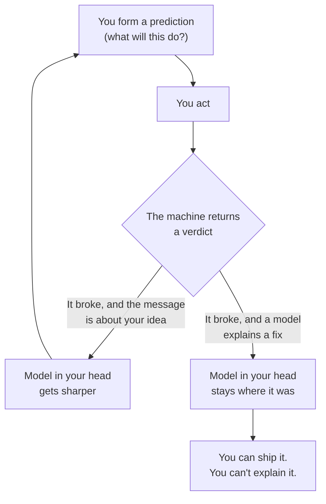

The first time I noticed it, nothing had gone wrong.

I'd spent about forty minutes generating, wiring and shipping a feature that would have taken me most of a day a couple of years ago. It worked on the first try. I deployed it, closed the laptop, and felt absolutely nothing — not satisfaction, not relief, not even the small lazy pleasure of being done early.

Then a colleague asked how the cache invalidation worked, because his integration test was failing after my change. And I couldn't answer him. Not "I'd have to check" — I couldn't answer. I had shipped code I could not explain.

So we read it together, which took twenty minutes and should have taken four. The model had added a read-through cache in front of the account settings lookup, and the write path updated the entry under the caller's own key while the read path derived its key from the tenant namespace. Two different derivations, both plausible, neither wrong in isolation. Under load with two tenants interleaving requests, customer B could read customer A's settings for up to the TTL. Nothing in the tests caught it because every fixture used a single tenant — which is exactly what the generator's example had used, because I'd pasted a single-tenant snippet when I asked.

It was a multi-tenant cache isolation bug sitting in a diff I had approved by scrolling. Catching it cost twenty minutes and one colleague who happened to write the failing test. Not every instance is that lucky.

That gap, shipped but not understood, is the whole subject of this post. It's not a productivity problem, and it isn't really about my feelings. It's the reason a growing number of people who used to love this job are quietly falling out of love with it — and it's the reason I've changed what I insist on before anything I write reaches a review.

## What the numbers say

I want the evidence up front, because there's a lot of confident hand-waving in both directions and I've been around long enough to distrust clean narratives.

METR ran a randomised controlled trial in mid-2025 with sixteen experienced open-source developers — people averaging five years of contribution to mature repositories with a million-plus lines of code — and gave them 246 real issues from their own projects, randomly split between "you may use AI tools" and "you may not." When AI was allowed, they took **19% longer**. Before the study they forecast that AI would make them 24% faster. Afterwards, still believing it had sped them up by about 20%, they had in fact been slowed down by 19%. The experts they polled — economists and ML researchers — predicted the opposite direction entirely.

Before anyone cites that at me as a stop sign: METR published a follow-up in early 2026 with a redesigned method, and for late-2025 tools the same developers now look like they were roughly 18% *faster*, with a confidence interval running from 38% slower to 9% faster. The sign of the effect is unsettled. The tools moved. I'd be sceptical of anyone, including me, quoting the original number as current fact.

What hasn't moved is the **gap between perceived and measured**. That's the durable finding, and it lines up with everything else in the field.

Stack Overflow's 2025 survey of 49,000 developers found 84% now use or plan to use AI tools in their workflow, while trust in the accuracy of those tools fell from 40% to 29% and positive sentiment dropped from over 70% to 60%. The single biggest frustration, named by 66%, is dealing with AI solutions that are *almost right, but not quite*. Forty-five percent say debugging AI-generated code takes more time than writing it. And buried in the same survey is the line I keep coming back to: 61% said they still want to fully understand their own code, and three quarters said they'd rather ask another person when they don't trust an answer.

Meanwhile a controlled GitHub study back in 2023 found developers finished a specified task roughly 55% faster with a Copilot. Both results are real, and the reconciliation is the interesting part: models are fast when the problem is **fully specified and self-contained**, and slow when the work is **situated in a codebase you hold in your head**. Greenfield HTTP server with a clear right answer: big win. Your own five-year-old repository with its undocumented conventions and two migrations pending: slower.

That's the same shape I wrote about in [the piece on asking models good questions](/blog/how-to-ask-ai-questions-properly/) — a specified problem and a situated problem are different problems, and only one of them is what the model was handed. This time the cost lands somewhere less visible than an outage. It lands in how the work feels.

## The loop that was doing the work

Here's what I think is actually going on, and why it isn't about typing speed.

Programming always delivered an unusually cheap version of flow. Csikszentmihalyi's conditions are a clear goal, immediate feedback, and a challenge sitting just above your current ability. A codebase gives you all three for free: you want the test to pass, you run it, it tells you the truth within a second, and the thing you're fixing is slightly harder than the last one. The pleasure was never in the keystrokes. It was in **contact with a system that responds honestly**.

I know that sounds romantic, so let me put it in engineering terms. The loop is: you form a prediction about what the machine will do, you act, the machine returns a verdict, you update the model in your head. The model in your head is the asset. It's what lets you look at a stack trace and *know* which of four services is lying, rather than reading a runbook.

Now insert a fluent layer between your intent and the verdict. The feedback stops coming from the machine and starts coming from a text distribution. It's softer — plausible rather than true — and crucially, when it's wrong, the model absorbs the failure instead of you. You don't update. You re-prompt.

Ericsson's work on deliberate practice is blunt about this: expertise requires feedback that is immediate *and* informative. Remove either and the skill stops forming. Which means enjoyment and learning are not two separate things that happen to decline together. They're the same measurement. The moment I couldn't explain the cache invalidation to my colleague was exactly the moment I'd stopped enjoying the work, and I'd felt the absence before I could name the cause.

Bainbridge saw this coming in 1983, writing about process-control plants rather than pull requests. The "ironies of automation": the more reliable the automation, the more the operator's skill degrades, and the operator is needed most at precisely the moment the automation does something it wasn't designed for. She was describing chemical plants. It's now a description of a normal Tuesday.

## Where the model should sit

None of this argues for putting the tools down. I use them constantly, and the case against is weaker than the nostalgists claim. A lot of what people call craft was drudgery we'd learned to romanticise — nobody misses hand-writing a Jenkinsfile, and if what you miss is the typing, what you miss is typing.

The question is placement. The model should sit where a **fast, well-read, slightly unreliable junior** sits: generating options, draft implementations, the boring middle of a task, anything where being wrong is cheap and the verdict arrives immediately. It should not sit between you and the machine's verdict, because that's the position where the learning — and the enjoyment — used to happen.

So the working rule I've landed on is embarrassingly simple: **I'm allowed to accept only what I can explain.** Not "what I trust," not "what passes the tests." Explain. If I can't walk a colleague through why the diff does what it does, I don't understand it yet, and shipping it anyway is borrowing comprehension I'll have to repay later with interest, usually at three in the morning.

## Six things that actually changed how it feels

Advice time. These are the specific moves that brought the enjoyment back for me, and I've tried to keep out anything that's really just discipline moralising with extra steps.

- **Keep one thing permanently by hand.** For me it's schema design and the migrations that follow from it — the part where a wrong shape costs six months. I sketch it on paper before anything generates it. Pick your own; the specific choice matters less than that there's one place where you are unambiguously the author.

- **Own something small, completely.** I keep a side project the model isn't allowed to architect. Small enough that I can hold every line of it in my head. Comprehension doesn't scale, and neither does the pleasure of ownership — a codebase you can't hold in one mind is a codebase you can only navigate, not enjoy.

- **Treat the output as a hypothesis, not an answer.** Run the same thing twice in fresh contexts. Ask what would make it wrong before asking it to proceed. Check against the machine rather than the prose. I wrote a whole post on [the disconfirming ask](/blog/how-to-ask-ai-questions-properly/) because it's the one habit that converts a confident paragraph into something I'd defend in a review.

- **Manufacture hard feedback loops on purpose.** Anything with an unambiguous verdict and instant turnaround: a puzzle with a single right answer, a benchmark you can watch move, a failing test you wrote yourself before you let anyone else near the problem. These are where the old feeling lives, and you can have them daily regardless of what your day job looks like.

- **Read code you didn't write, including the model's, as if it came from a stranger's pull request.** Review was always where senior judgement actually lived. Now there's an infinite supply of unfamiliar code to practise it on, which is a strange silver lining: the scarce skill has become legible because fluent-but-unexplained code is everywhere and everyone can tell the difference when someone can explain.

- **Keep a ledger of what it got wrong.** I have a note file of AI mistakes that survived my review or slipped past it. It's the most-read document I own. Its value isn't the entries — it's that going back to it is a fifteen-second repetition of the exact judgement I want to keep sharp, and it converts the frustration that otherwise just evaporates into material.

There's a seventh that isn't really a habit. Write about the systems you build, for other people. Not for reach — for the test. Halfway through a draft you find out which parts you were only ever gesturing at, and it happens on your own prose long before anyone else has to discover it.

## What it looks like when it isn't just me

Personal habits are easy. The interesting version is what happens when you're responsible for other people's code and a service with an on-call rotation, because that's where "I'd have to check" stops being a style preference.

Four things I run differently now:

- **Design reviews start with the failure mode, not the diagram.** Anyone can present a happy-path architecture that a model helped produce and have it look right. I ask two questions and I ask them early: what does this do when the dependency is slow but not down, and which part of this can the author not yet explain? The second question isn't a trap — it's an invitation to say "that part," which is where the design review actually becomes useful. A team that can name its own unexplained seams is safer than a team that has silently absorbed them.

- **Every non-trivial diff gets a written justification from the human who merged it.** Not a description of what the code does — that's the easy half and a model will produce a beautiful version of it. The reason: why this shape and not the obvious alternative, what it costs at our volume, what we'd see first if it were wrong. This takes minutes and it is the cheapest incident-prevention measure I've found, because the author discovers the gap in their own understanding while it's still a comment rather than an outage.

- **Incidents get a comprehension question in the review.** After the smoke clears, one question above the timeline: was there code in the blast radius that the team had shipped without someone being able to explain it? I've asked this maybe a dozen times. It has never once been the root cause on the first pass, and it has been a contributing factor more times than I'd like to write down — a plausible-looking retry, an "obviously correct" cache layer, a timeout that nobody could say the origin of.

- **Mentoring is now mostly teaching people to explain.** The juniors I work with are fluent with tools I didn't have at their stage, and the thing holding them back isn't output volume — it's that they can't yet narrate their own decisions under questioning, which is precisely what a staff-level design review demands of them. So the exercise is simple: walk me through the diff as if I've never seen it, including the parts you didn't write. The ones who get good at that get staffed on the harder work, every time, in every team I've seen. Fluency is table stakes now. Articulation is the filter.

None of this is anti-AI. All of my teams use the tools heavily. The standard is just pointed at the human side of the transaction, because that's the side that still has to answer for the system at three in the morning.

## If you're learning right now

This is the part I'd most want a junior to read, because the advice the culture hands them is roughly backwards.

The danger of learning to code with a model isn't missing syntax. Syntax was never the hard part and it's freely available everywhere. The danger is never once having the experience of being stuck and getting yourself out — because that specific sequence is where mental models get built. You cannot acquire a model of how a request moves through a system by reading the correct description of it. You acquire it by watching one break and reasoning about why.

So the advice isn't abstinence, and it isn't the "AI won't get you hired" scare line, which is already false in most places I've seen. It's a scheduling rule: **give yourself a real hour before you ask.** Not out of purity — because struggling *is* the mechanism, and a model asked at minute two removes a problem you hadn't yet failed at, which is the only kind worth having.

Stack Overflow's own data supports the instinct: the developers most sceptical of AI output turn out to be the experienced ones, with a 2.6% "highly trust" rate. The people who've carried the pager longest are the least willing to be talked into it. There's a reason the confidence curve runs opposite to the experience curve.

## Things I believe that cut against this post

I'd be doing the thing I dislike if I left these out.

- **"You must understand everything" is applied selectively and always has been.** Nobody understands their compiler, their allocator, or the branch predictor on their CPU, and we were all fine. The real bar was never total comprehension. It's *knowing which parts you don't understand* — which is a much harder and much more honest standard, and one that fluent output actively works against, because it hides the seams.

- **The productivity evidence is genuinely unsettled, and the tools are eighteen months younger than the loudest claims.** Maybe the transition cost disappears as the models improve. If it does, half this post ages badly. I'd still keep the habits, because they cost almost nothing either way, and the thing they protect — being able to explain your own system — was never dependent on the state of the art.

- **Nobody's employer is optimising for your enjoyment.** Your manager wants throughput, and "I want to read the diff myself" is a hard sell against a dashboard showing story points. The team practices above are my answer to that tension — they're cheap enough to defend as incident prevention rather than as happiness — but I won't pretend they always win. This post is partly about your relationship with the work rather than your company's metrics, and I'd rather say that plainly than dress a personal practice up as a business case.

- **And the uncomfortable one:** some of what I'm describing is just the discomfort of being a beginner again, which is unpleasant at any age and easy to dress up as a principled position. I have no clean way to rule that out in my own case. The fact that the work got enjoyable again when I changed these things is evidence, but it isn't proof.

## The part that got more valuable, not less

Here's the shift I'd point at if I had to summarise it in one line.

Before the models, the scarce thing was getting an idea to run. Now getting an idea to run is nearly free, and the scarce thing is **knowing whether the thing that runs is right** — and being able to say why, to a person, under questioning.

That's never been more legible in an interview or a design review. The codebase is full of plausible output now, and everyone reading it can tell that it's plausible without being able to tell whether it's correct. The engineer who can stand at a whiteboard and explain why the retry budget is 10% and not 30%, who can say "that's wrong" to a confident answer and show the counter-example, who can name the part of their own system they don't fully understand — that person just got rarer and more obvious at the same time.

I've been on the hiring side enough to know what actually lands. It was never the number of languages. It was always the moment someone explained a hard thing clearly, including the bit where they were wrong first.

That moment has become rarer and easier to fake at the same time, which is an unusual position for an interview loop to be in. A candidate can now arrive with a portfolio of work they can't narrate, and for a while it'll work, because fluent code reads like fluent understanding. It doesn't take a panel to tell the difference though — it takes one question with a little teeth: *walk me through the part you'd defend if I disagreed.* The people who've been protecting their own comprehension answer immediately and in specifics. The people who've been outsourcing it buy themselves ten seconds and then describe the intent rather than the mechanism.

I'd rather hire the person who can point at the seam they don't understand yet and tell me why it doesn't keep them up at night. That's the whole skill: knowing where your model of the system is solid, where it's thin, and which one is which at the moment it matters. Everything else is available by the yard.

So: protect the loop. Let the model have the drudgery, the scaffolding, the tedious middle — all of it, happily, every day. But keep the prediction, the verdict, and the explanation. Those three were always the job. The typing was never the point, and now we get to find out what was.

— Yoosuf
